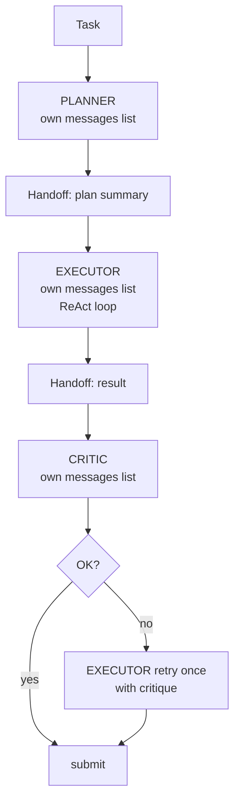
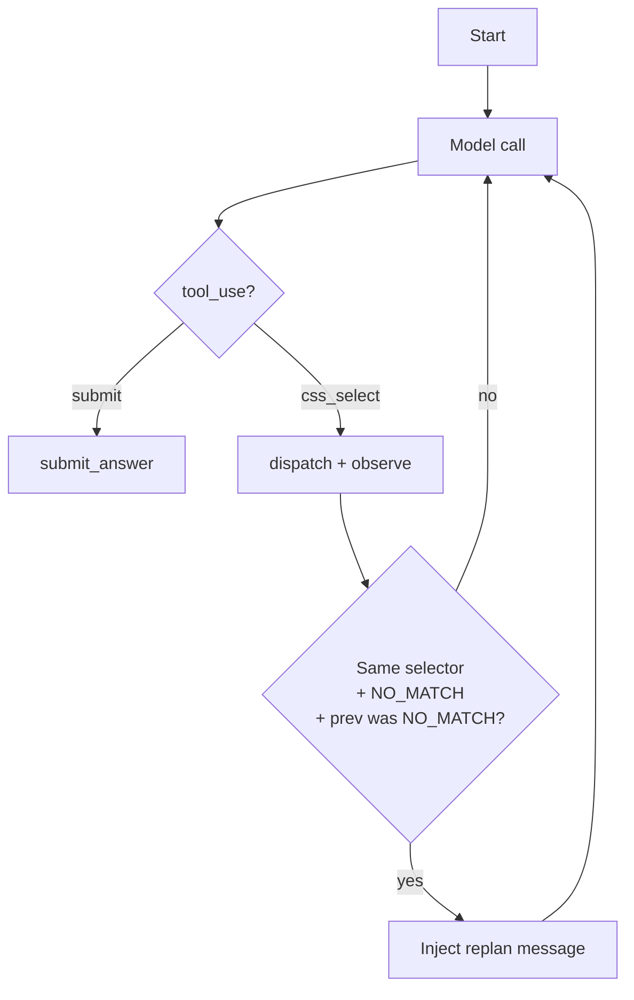
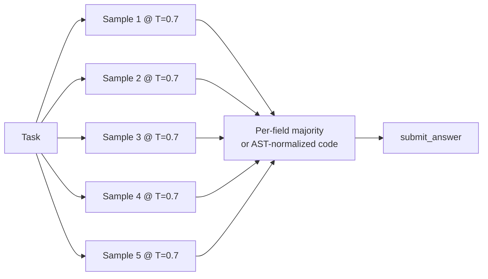
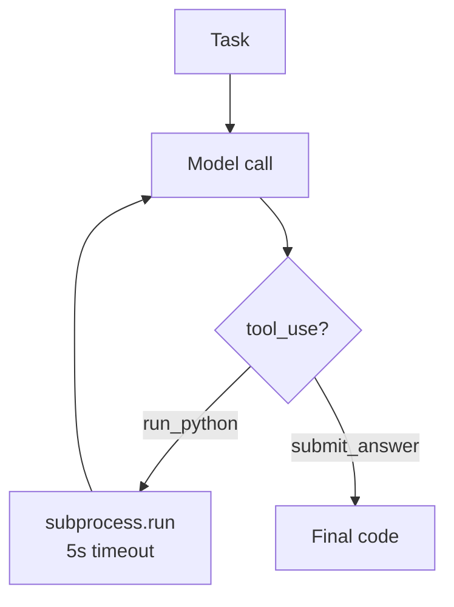
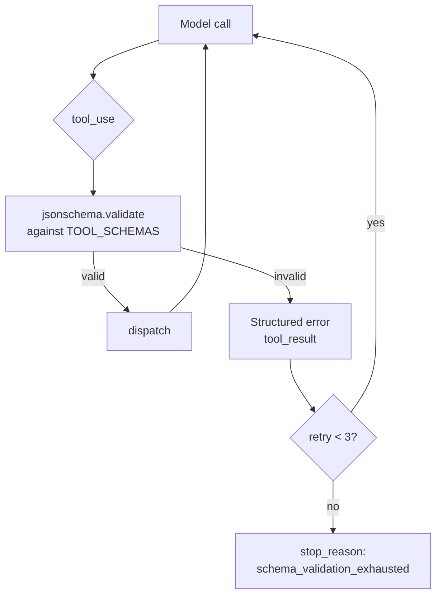
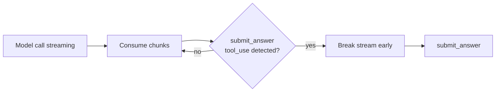
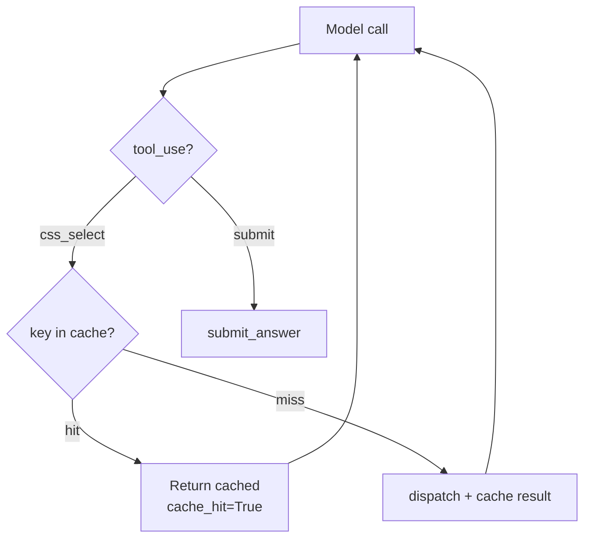

<objective>
Refresh the article and Medium HTML to integrate the 8 new harnesses. This plan is **gated on user-triggered matrix re-runs** — it can only execute meaningfully AFTER the user has run:

```bash
python scripts/run_full.py --seeds 3 --yes              # HTML matrix (~2h)
python scripts/run_code_benchmark.py --seeds 3 --yes    # Code-gen matrix (~1h)
```

Per CONTEXT cross-cutting decision: matrix runs are operationally expensive (~3 hours of local CPU on glm-4.7-flash). The implementation phase ends at "harnesses + freeze move + tests green" (Plans 01-07). This plan is the post-matrix continuation.

`autonomous: false` because:
1. Required matrix outputs (`runs/<id>/summary.csv`) don't exist until the user runs the scripts.
2. Article prose updates touch the "implications" / "what surprised me" framing — those are author judgment calls about what the new numbers actually MEAN; numbers themselves are mechanical interpolation but their narrative isn't.
3. A checkpoint at the start confirms the matrix outputs are present before the executor proceeds.

Output: writeup/article.md updated with 8 new harness blocks + framework mapping + refreshed numerical tables + dollar extrapolation; writeup/article-medium.html regenerated; 8 new Mermaid diagrams committed.
</objective>

<execution_context>
@C:/Users/Utilisateur/.claude/get-shit-done/workflows/execute-plan.md
@C:/Users/Utilisateur/.claude/get-shit-done/templates/summary.md
</execution_context>

<context>
@.planning/STATE.md
@.planning/phases/08-expand-harness-family/CONTEXT.md
@.planning/phases/08-expand-harness-family/08-RESEARCH.md
@.planning/phases/08-expand-harness-family/08-05-VERIFY.md
@writeup/article.md
@.planning/phases/08-expand-harness-family/08-07-SUMMARY.md
</context>

<tasks>

<task type="checkpoint:human-verify" gate="blocking">
  <name>Task 1: Confirm matrix re-runs are complete and identify the run directories</name>
  <files>(none — checkpoint task; no file modifications)</files>
  <action>Pause for user. Verify both matrix runs (HTML and code-gen) are complete and the user supplies the two run-directory IDs. Concrete steps: (1) `ls -lt runs/` and identify the two latest, (2) confirm summary.csv + frontier.png + heatmap.png + runs_completed.jsonl exist in each, (3) confirm new harness names appear in summary.csv harness column, (4) wait for user 'approved' with HTML_RUN=... CODE_RUN=... values.</action>
  <verify>User has typed 'approved' with both run-directory IDs stated, OR has reported a missing/incomplete matrix run.</verify>
  <done>Both matrix outputs are confirmed present and complete; subsequent tasks reference $HTML_RUN and $CODE_RUN.</done>
  <what-built>
The freeze tag has moved (Plan 08-07). The user is expected to have triggered:
- `python scripts/run_full.py --seeds 3 --yes` — produces a fresh `runs/<html_id>/` directory with summary.csv, frontier.png, heatmap.png, traces.
- `python scripts/run_code_benchmark.py --seeds 3 --yes` — produces a fresh `runs/<code_id>/` directory.

Before this plan can do meaningful work, both runs must be complete and their directory IDs identified.
  </what-built>
  <how-to-verify>
1. List the runs directory:

```bash
ls -lt runs/ | head -20
```

The TWO most recent directories should be the Phase 8 HTML and code-gen runs (one of each kind).

2. For each, confirm the expected artifacts exist:

```bash
HTML_RUN=$(ls -t runs/ | head -1)   # Adjust if order doesn't reflect HTML vs code
ls runs/$HTML_RUN/
```

Expected files in each run directory:
- `summary.csv` — per-harness aggregated metrics (success rate, tokens, cost, wall-clock)
- `frontier.png` — scatter chart with error bars
- `heatmap.png` — per-harness × per-field accuracy
- `runs_completed.jsonl` — manifest diff = empty (all cells completed)
- traces in some form (per-cell JSONL)

3. Verify the matrix actually included the new harnesses:

```bash
head -1 runs/$HTML_RUN/summary.csv  # column header
cut -d',' -f1 runs/$HTML_RUN/summary.csv | sort -u  # harness names
```

Expected: includes `tree_of_thoughts`, `multi_agent`, `react_with_replan`, `self_consistency`, `tool_use_with_validation`, `cached_react`, and (per 08-05-VERIFY outcome) optionally `streaming_react`.

```bash
cut -d',' -f1 runs/$CODE_RUN/summary.csv | sort -u
```

Expected: `multi_agent`, `self_consistency`, `program_aided`, `tool_use_with_validation` (plus the 5 prior code-gen harnesses).

4. **If matrix outputs are MISSING:** stop here. Report which scripts haven't been run. The user must run them before this plan can continue. Do NOT fabricate numbers.

5. **If matrix outputs are PRESENT but the manifest diff is non-empty:** stop. The runs are incomplete. Report missing cells; user re-runs with `--resume <id>`.

6. **If matrix outputs are PRESENT and complete:** record the two run-directory IDs (e.g., `HTML_RUN=20260424_153012_a1b2`, `CODE_RUN=20260424_173344_f3e4`) and approve. Subsequent tasks reference these.
  </how-to-verify>
  <resume-signal>Type "approved" with the two run-directory IDs ("HTML_RUN=... CODE_RUN=..."), or describe which matrix run is missing/incomplete.</resume-signal>
</task>

<task type="auto">
  <name>Task 2: Add 8 new harness description blocks + framework mapping to article.md</name>
  <files>writeup/article.md, writeup/diagrams/tree_of_thoughts.md, writeup/diagrams/multi_agent.md, writeup/diagrams/react_with_replan.md, writeup/diagrams/self_consistency.md, writeup/diagrams/program_aided.md, writeup/diagrams/tool_use_with_validation.md, writeup/diagrams/streaming_react.md, writeup/diagrams/cached_react.md</files>
  <action>
Step 1 — Read the current `writeup/article.md` to identify:
- Existing per-harness description block template (look for the header pattern; each existing harness has its own block).
- Existing framework-mapping section (probably a bulleted list).
- Existing dollar-extrapolation table format.

Use the EXACT structure of an existing harness block. Do NOT invent a new format. Each new block has:
- `## <harness_name>` header (or matching the existing header level)
- `**What it does:**` paragraph
- `**In production:**` example framework / paper reference
- `**Strengths:**` bullet list
- `**Weaknesses:**` bullet list (must include cost/correctness trade-offs documented in CONTEXT)
- `**Use when:**` one-line guidance
- `### Diagram` subsection embedding (or linking) the Mermaid diagram from `writeup/diagrams/<harness>.md`

Step 2 — Create 8 new Mermaid diagram source files in `writeup/diagrams/`. One file per harness. Each file is a `.md` with a single `\`\`\`mermaid` block. Examples:

`writeup/diagrams/tree_of_thoughts.md`:
```mermaid
flowchart LR
  T[Task] --> P[Propose 3 selectors<br/>(toolless model call)]
  P --> S1[Score selector 1<br/>num_matches/avg_text_len]
  P --> S2[Score selector 2]
  P --> S3[Score selector 3]
  S1 --> W{Pick highest score}
  S2 --> W
  S3 --> W
  W --> F[Final extract call<br/>with winner's text]
  F --> A[submit_answer]
```

`writeup/diagrams/multi_agent.md`:


`writeup/diagrams/react_with_replan.md`:


`writeup/diagrams/self_consistency.md`:


`writeup/diagrams/program_aided.md`:


`writeup/diagrams/tool_use_with_validation.md`:


`writeup/diagrams/streaming_react.md`:


`writeup/diagrams/cached_react.md`:


Step 3 — append/insert the 8 description blocks into `writeup/article.md` in the SAME section that holds the existing 8 harness descriptions. Match the exact header style and field set the existing blocks use.

Per-harness content guidance:

**tree_of_thoughts**
- What: propose 3 selectors → score each by `(num_matched / avg_text_len)` deterministically → use winner.
- In production: Yao et al. 2023 "Tree of Thoughts" paper (this is a heuristic-scored variant — paper uses model self-eval).
- Strengths: deterministic, no extra model call, reproducible.
- Weaknesses: heuristic scoring is not paper-faithful; weaker than model-judged variant for ambiguous fields.
- Use when: candidate generation is the hard part; ranking is mechanical.

**multi_agent**
- What: planner / executor / critic with ISOLATED message histories; structured handoff messages.
- In production: CrewAI, AutoGen, LangGraph multi-agent patterns.
- Strengths: clean separation of concerns; faithful to multi-agent semantics.
- Weaknesses: ~3× tokens vs single-log harnesses; coordination overhead.
- Use when: roles benefit from focused context (planner doesn't need execution detail).

**react_with_replan**
- What: ReAct loop + detect 2 consecutive NO_MATCH on same selector → inject replan prompt.
- In production: loop-detection + recovery patterns; agent stall handling.
- Strengths: cheap signal that catches the most common stall pattern.
- Weaknesses: detection is narrow (one specific failure mode); other stall patterns slip through.
- Use when: traces show selector retries dominating failure cells.

**self_consistency**
- What: N=5 samples at temperature=0.7, vote per-field for HTML, AST-normalized for code.
- In production: Wang et al. 2022 "Self-Consistency Improves Chain of Thought."
- Strengths: resilient to one-off model errors; simple to apply on top of any baseline.
- Weaknesses: 5× cost of single_shot; gains were larger on weaker models in original paper.
- Use when: failure rate is dominated by stochastic noise, not systematic gaps.

**program_aided**
- What: model uses run_python during reasoning to verify intermediate values, then submits.
- In production: PaL paper (Gao et al. 2022); execution-as-reasoning patterns.
- Strengths: catches off-by-one and edge cases the model would otherwise miss.
- Weaknesses: small models often skip run_python entirely (Pitfall 7); 5s subprocess overhead per call.
- Use when: code-gen tasks have non-trivial input/output examples worth checking.

**tool_use_with_validation**
- What: validates every tool call against tools.py JSON schemas via jsonschema; retries up to 3.
- In production: Pydantic-style argument validation; defensive tool dispatch.
- Strengths: structurally rejects malformed tool calls; isolates schema bugs from runtime bugs.
- Weaknesses: rejects ints-for-string-fields that single_shot's str() cast would forgive (per Pitfall 5).
- Use when: tool schemas are stable and you want to make schema violations a measurable failure mode.

**streaming_react**
- What: ReAct loop with streamed responses; terminates stream early on submit_answer detection.
- In production: early-termination optimization for tool-use streams.
- Strengths: latency reduction when models tend to emit long-tail prose after submit_answer.
- Weaknesses: requires backend support (Anthropic SDK + reliable Ollama). PER 08-05-VERIFY OUTCOME — if FAIL, this section MUST cite Ollama issue #13840 and state the harness is implemented + unit-tested but not matrix-validated on the current backend.
- Use when: model frequently emits trailing text after the final tool call.

**cached_react**
- What: ReAct loop with cell-scoped (html_hash, selector) cache for repeat selectors.
- In production: in-memory result memoization (cell-scoped only — not cross-cell).
- Strengths: collapses wall-clock cost of repeated selectors; quantifies "what react would cost if tool calls were free."
- Weaknesses: cell-scoped cache means no cross-cell savings; cache-hit count is co-equal with model behavior, not a tool reduction.
- Use when: traces show high selector-retry rates within a cell.

Step 4 — update the framework-mapping section (bulleted list) with one bullet per new harness. Match the existing style. Eight new bullets:
- `multi_agent → CrewAI / AutoGen / LangGraph`
- `tree_of_thoughts → Yao et al. 2023 (heuristic scorer variant)`
- `program_aided → Gao et al. 2022 (PaL)`
- `self_consistency → Wang et al. 2022`
- `tool_use_with_validation → Pydantic-style argument validation`
- `streaming_react → mid-stream early-termination on tool detection`
- `cached_react → in-memory result memoization (cell-scoped)`
- `react_with_replan → loop-detection + recovery`

If the existing framework-mapping section uses a different syntax (e.g., a markdown table), match THAT format; do not invent a list.

Step 5 — DO NOT modify the dollar-extrapolation table or numerical findings tables in this task. Those are Task 3 (data interpolation from the new summary.csv files). Keep this task focused on prose + diagrams.
  </action>
  <verify>
1. `grep -c "tree_of_thoughts" writeup/article.md` ≥ 2 (header + framework-mapping bullet)
2. `grep -c "multi_agent" writeup/article.md` ≥ 2
3. All 8 diagram files exist: `ls writeup/diagrams/{tree_of_thoughts,multi_agent,react_with_replan,self_consistency,program_aided,tool_use_with_validation,streaming_react,cached_react}.md`
4. Each diagram file has a `mermaid` code block: `for f in writeup/diagrams/{tree_of_thoughts,multi_agent,react_with_replan,self_consistency,program_aided,tool_use_with_validation,streaming_react,cached_react}.md; do grep -q "mermaid" "$f" || echo "MISSING mermaid in $f"; done`
5. The article still parses as valid Markdown (no broken header levels). Quick sanity: `grep -c "^## " writeup/article.md` is monotonic in number of harness sections.
  </verify>
  <done>writeup/article.md has all 8 new harness blocks + framework-mapping bullets; 8 new diagram files exist with Mermaid sources; existing prose preserved.</done>
</task>

<task type="auto">
  <name>Task 3: Refresh numerical tables + dollar extrapolation from new matrix runs; regenerate Medium HTML</name>
  <files>writeup/article.md, writeup/article-medium.html</files>
  <action>
**Critical: numbers MUST come from `runs/$HTML_RUN/summary.csv` and `runs/$CODE_RUN/summary.csv`. Per ART-02: "Numbers in article are never hand-typed — always interpolated from CSV." Do not type any number in this task that you have not first read from one of the two summary.csv files.**

Use the run IDs captured in Task 1.

Step 1 — Inspect the two summary.csv files:

```bash
HTML_RUN=<from Task 1>
CODE_RUN=<from Task 1>
head -1 runs/$HTML_RUN/summary.csv
column -t -s ',' runs/$HTML_RUN/summary.csv | head -25
column -t -s ',' runs/$CODE_RUN/summary.csv | head -25
```

Identify columns. Expected (from Phase 3 + 4 work): `harness, success_rate, ci_low, ci_high, field_accuracy, avg_input_tokens, avg_output_tokens, avg_tool_calls, avg_wall_clock_s, total_cost_usd, cost_per_success_usd, ...`.

Step 2 — Locate the existing numerical-findings tables in `writeup/article.md`. There should be (per ROADMAP Phase 8 success criterion #6):
- A "Part 1: HTML extraction" results table with one row per HTML harness
- A "Part 2: Code generation" results table with one row per code-gen harness
- A dollar-extrapolation table (the project mentions $2.50/M input + $10/M output as held-constant frontier-model prices)

Step 3 — Refresh BOTH numerical tables. For each table:
- Read the header row to identify expected columns.
- Replace the table body with rows derived from the corresponding summary.csv. Each cell is the CSV value for that (harness, metric).
- Format numbers consistent with the existing table style (e.g., success_rate as `0.80 [0.45, 0.96]` with Wilson CI bounds; cost as `$0.0234`; tokens as integers with commas).
- Preserve column order. Add new harness rows at the bottom of the existing table OR re-sort by some natural key (e.g., success_rate descending) — match what the article already does.

Step 4 — Refresh the dollar-extrapolation table. Per ROADMAP Phase 8 success criterion #8: "recomputed against the new token-cost rows for the expanded harness set, holding the same frontier-model list-prices ($2.50/M input, $10/M output) constant for comparability."

For each harness in the matrix, compute extrapolated cost at frontier prices:
- `frontier_cost_usd = (avg_input_tokens / 1_000_000 * 2.50) + (avg_output_tokens / 1_000_000 * 10)` per task
- Extrapolate to a hypothetical operational scale if the existing table does so (e.g., per 1000 tasks, per 1M tasks).

Use the SAME row count + format as before; just refresh the numbers using the new summary.csv.

Step 5 — Update the methodology section to cite the freeze SHA and the run directory paths. Per ART-04 / INTG-07 (closed in earlier phases but applicable):
- Replace the freeze-SHA citation with `git rev-parse harnesses-frozen` value.
- Replace `runs/<id>/` directory references with the actual `$HTML_RUN` and `$CODE_RUN` IDs.

Step 6 — If 08-05-VERIFY.md said `**Outcome:** FAIL` for streaming_react: insert a small subsection (or sentence) in the methodology section noting that streaming_react is implemented + unit-tested but not matrix-validated on the current backend; cite Ollama issue #13840.

Step 7 — Regenerate the Medium HTML:

```bash
python scripts/build_medium_html.py
```

Verify the output HTML reflects the new article.md content:

```bash
grep -c "tree_of_thoughts" writeup/article-medium.html
```

Expected: > 0. The exact count depends on how many times the harness name appears in the article (header + framework-mapping bullet + table row + at least once more = ~4+).

Step 8 — Verify diagrams render. If `scripts/build_medium_html.py` already converts Mermaid blocks to PNGs (or links them as `.svg`), the new diagram files should appear in the HTML output. If not, the diagrams are referenced as plain Mermaid blocks (which Medium does not render natively — but the `.md` file IS the article source for review, so the diagram source is preserved).

Step 9 — Verify reproducibility check. Per ROADMAP Phase 6 success criterion #4: "Every number in the article prose can be re-derived by running `python -m harness_eng.analysis` against the cited run directory." Quick sanity:

```bash
python -c "
import csv
with open('runs/$HTML_RUN/summary.csv') as f:
    reader = csv.DictReader(f)
    for row in reader:
        print(row['harness'], row.get('success_rate'), row.get('cost_per_success_usd'))
"
```

Cross-check 2-3 numbers in the new article tables against this CSV output. If any discrepancy: fix the article, not the CSV.
  </action>
  <verify>
1. `grep -c "harnesses-frozen" writeup/article.md` ≥ 1 (methodology cites the freeze tag — directly or via the resolved SHA)
2. The new run IDs appear in the article: `grep -c "$HTML_RUN" writeup/article.md` ≥ 1 and `grep -c "$CODE_RUN" writeup/article.md` ≥ 1
3. Article contains rows for the new harnesses in the numerical tables: `for h in tree_of_thoughts multi_agent react_with_replan self_consistency program_aided tool_use_with_validation cached_react; do grep -c "^|.*$h" writeup/article.md || echo "MISSING $h"; done`
4. `python scripts/build_medium_html.py` exits 0
5. `grep -c "tree_of_thoughts" writeup/article-medium.html` > 0
6. Sanity check: a sample number from the article matches a value in summary.csv (manual spot-check by the author)
  </verify>
  <done>Article numerical tables refreshed from new summary.csv files; dollar extrapolation recomputed against $2.50/$10 frontier prices; methodology cites the new freeze SHA + run-directory IDs; Medium HTML regenerated and contains the new harnesses.</done>
</task>

<task type="checkpoint:human-verify" gate="blocking">
  <name>Task 4: Author review of refreshed article</name>
  <files>(none — checkpoint task; no file modifications)</files>
  <action>Pause for user. Author reviews the refreshed article end-to-end: per-harness blocks, framework-mapping section, numerical tables (spot-check vs summary.csv), dollar extrapolation, methodology citations. If a 'What surprised me' addition is warranted from the matrix results, the author writes that paragraph now. Concrete steps: (1) less writeup/article.md, (2) open writeup/article-medium.html in browser, (3) cross-check 2-3 numbers against runs/$HTML_RUN/summary.csv, (4) wait for user 'approved' signal or descriptions of issues to fix.</action>
  <verify>User has typed 'approved' (optionally with author-level edits noted) OR has described issues to fix in a follow-up edit.</verify>
  <done>Article is publish-ready; numbers verifiable from CSV; author-level prose updates (if any) integrated.</done>
  <what-built>
- writeup/article.md: 8 new harness description blocks + framework-mapping bullets + refreshed numerical tables + dollar-extrapolation refresh + methodology citation update
- 8 new Mermaid diagram source files in writeup/diagrams/
- writeup/article-medium.html: regenerated, includes new harness mentions
- All numbers sourced from runs/$HTML_RUN/summary.csv and runs/$CODE_RUN/summary.csv (no hand-typed)
  </what-built>
  <how-to-verify>
1. Read the article end-to-end:

```bash
less writeup/article.md
```

Specifically review:
- Per-harness blocks: are the strengths/weaknesses statements accurate to YOUR reading of the actual matrix results? (The block content was drafted from research+CONTEXT; the matrix may reveal nuances that change which is the dominant weakness.)
- Framework-mapping section: does it land cleanly with the existing prose style?
- Numerical tables: do the numbers match what you see in the matrix (spot-check 2-3)?
- Dollar extrapolation: is the comparison-to-frontier framing fair (frontier costs vs local-cost)?

2. Spot-check the Medium HTML:

```bash
# On Windows: open the HTML in a browser
start writeup/article-medium.html
# or on linux/mac:
xdg-open writeup/article-medium.html 2>/dev/null || open writeup/article-medium.html 2>/dev/null
```

Verify rendering: tables are tables (not raw markdown pipes), code blocks have syntax highlighting if expected, mermaid diagrams either render or are gracefully fallback'd.

3. Check the "What surprised me" section (if it exists from Phase 6 — note that ROADMAP marks Phase 6 as blocked-on-Phase-5, which has been deferred). For Phase 8 the article framing is mostly mechanical (numbers + new harness blocks). If the matrix produced a surprise (e.g., a new harness clearly dominates, or one underperforms expectation), this is the moment to write a paragraph saying so. Per ART-03: "What surprised me" section is the AUTHOR's job — never auto-drafted. If you have a surprise to add, add it now. If not, skip.

4. If everything reads correctly, approve. If something is wrong (a number doesn't match, a harness block over-claims something the matrix didn't validate), describe the issue.
  </how-to-verify>
  <resume-signal>Type "approved" with any author-level edits noted, or describe issues to fix.</resume-signal>
</task>

</tasks>

<verification>
- writeup/article.md has 8 new harness description blocks + framework-mapping bullets
- 8 new Mermaid diagrams exist as `writeup/diagrams/<harness>.md`
- Numerical findings tables include rows for every new harness in HARNESSES_BY_TASK_TYPE
- Dollar extrapolation recomputed at $2.50/M input + $10/M output
- Methodology cites the new freeze SHA + run-directory IDs ($HTML_RUN, $CODE_RUN)
- writeup/article-medium.html regenerated; contains new harness names
- If streaming_react was Ollama-excluded: article cites issue #13840 + "implemented but unmatrixed" framing
- Author has reviewed and approved
</verification>

<success_criteria>
- All ROADMAP Phase 8 success criteria #6, #7, #8 satisfied
- Numbers in tables verifiable from runs/$HTML_RUN/summary.csv + runs/$CODE_RUN/summary.csv (per ART-02)
- Article and Medium HTML reflect the expanded 16-harness matrix
- 8 new diagram source files committed
- Author has read end-to-end and approved
</success_criteria>

<output>
After completion, create `.planning/phases/08-expand-harness-family/08-08-SUMMARY.md` documenting:
- The two run-directory IDs the article cites ($HTML_RUN, $CODE_RUN)
- The freeze-tag SHA at article-publish time
- Counts: how many harnesses in the HTML matrix table, code-gen matrix table
- Streaming_react article framing (full member or "implemented but unmatrixed")
- Number of new diagrams committed
- Confirmation that scripts/build_medium_html.py succeeded and Medium HTML reflects the expanded set
- Phase 8 closeout: all 12 phase requirements (HARN-08..15, BENCH-06, RUN-07, ANAL-06, ART-05) satisfied; tag move logged; matrix re-runs published.
</output>
