<script src="https://cdn.jsdelivr.net/npm/mermaid@11/dist/mermaid.min.js"></script>
<script>
document.addEventListener('DOMContentLoaded', () => {
  document.querySelectorAll('pre > code.language-mermaid').forEach((el) => {
    const d = document.createElement('div');
    d.className = 'mermaid';
    d.textContent = el.textContent;
    el.parentElement.replaceWith(d);
  });
  mermaid.initialize({ startOnLoad: false, theme: 'default', securityLevel: 'loose' });
  mermaid.run();
});
</script>

# Same model, eight harnesses, two benchmarks

*A two-part controlled experiment on agent harness design. One frozen model. Two task types. 150 runs. Source + data: [github.com/jaafar-benabderrazak/harness-bench](https://github.com/jaafar-benabderrazak/harness-bench). Freeze commit: `66fd2ec`.*

---

## What this is, in one diagram

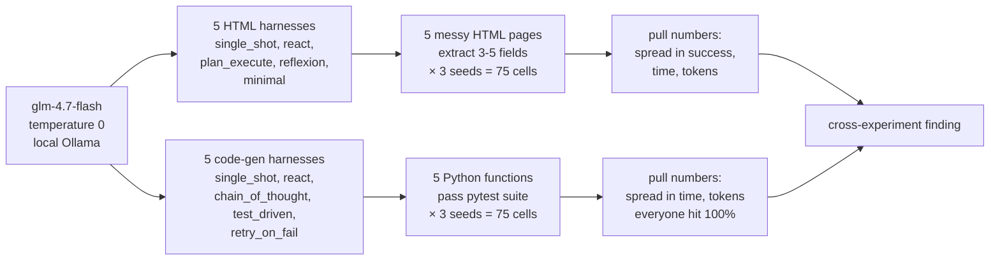

Same model. Two task types. Eight harnesses across both (five per task type, some shared). **150 graded runs, zero dollars** (open-source model, local inference).

---

## The finding, in one sentence

**On hard tasks, complex harnesses failed more than simple ones. On easy tasks, complex harnesses cost more than simple ones. `single_shot` won on wall-clock in both experiments.**

On HTML extraction (hard for this model):

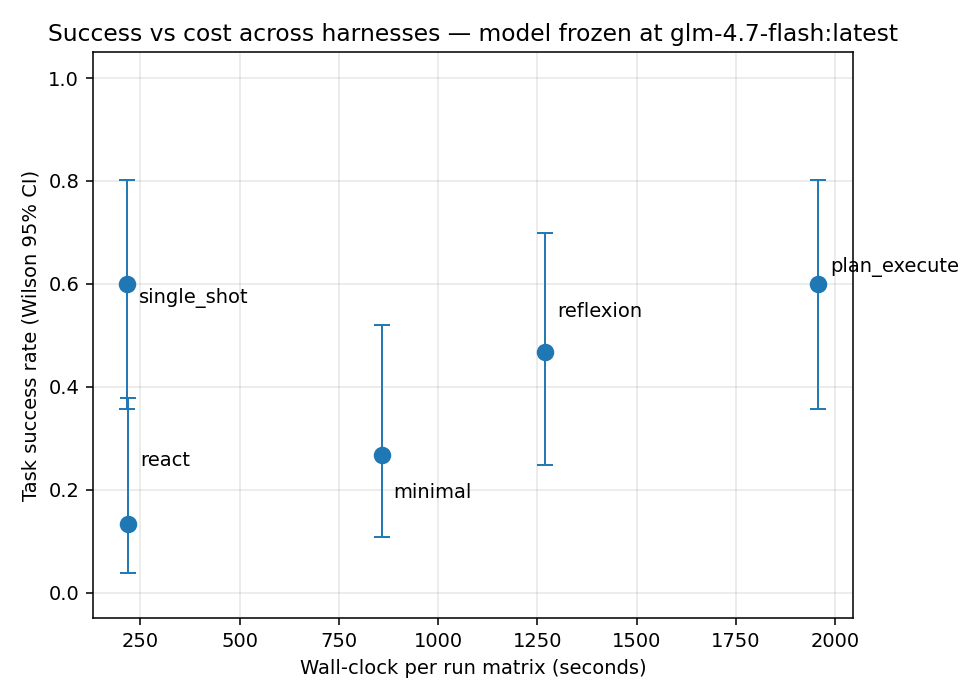

On code generation (easy for this model):

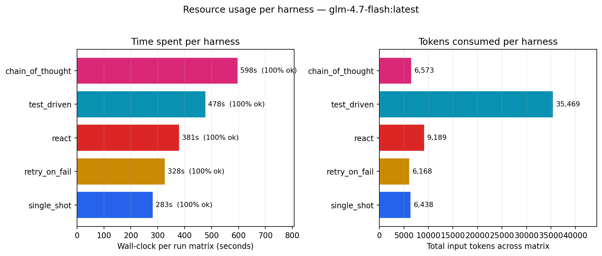

`chain_of_thought` took twice single_shot's wall-clock to score the same 15/15. `test_driven` used 6× the tokens. On the HTML side, `plan_execute` took 9× single_shot's wall-clock to score the same 9/15.

Harness complexity costs something. In both experiments, on this model, it didn't buy anything back.

---

## Why this experiment exists

A popular belief in agent-engineering discourse: the **model** is the main thing; the **harness** (the control loop around the model) is a minor detail — pick your model, glue on a standard ReAct loop, done.

This project flips the variable. Freeze the model. Vary only the harness. Measure what moves.

Running two separate experiments — one where the tasks are genuinely hard for the base model, one where they're easy — tests the hypothesis from both ends. If harness complexity is universally valuable, both experiments should show it paying. If it's a crutch for weak models, the hard experiment should show it paying more. If it's mostly dead weight on this model, *neither* experiment should show it paying — which is what the data says.

---

## The eight harnesses

All eight inherit from the same `Harness` base class. What varies is the control flow. Each has a `TOOL_WHITELIST` enforced by the runner so you cannot add a tool by accident.

### HTML-extraction family (5 harnesses)

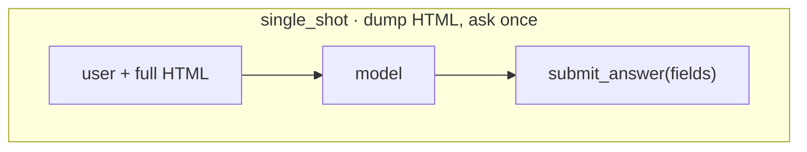

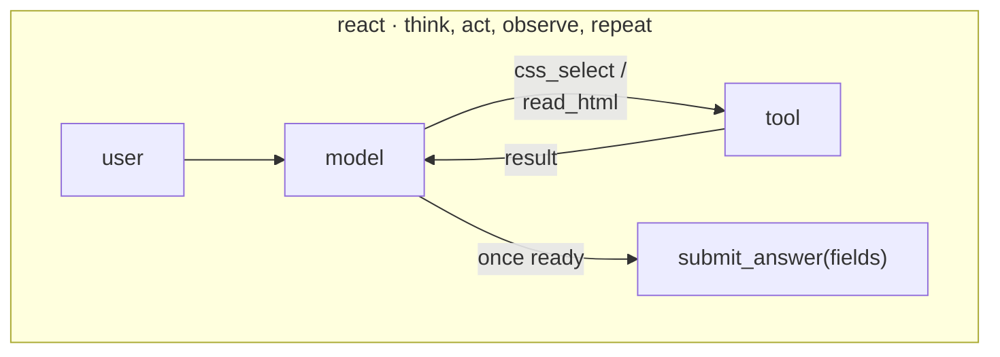

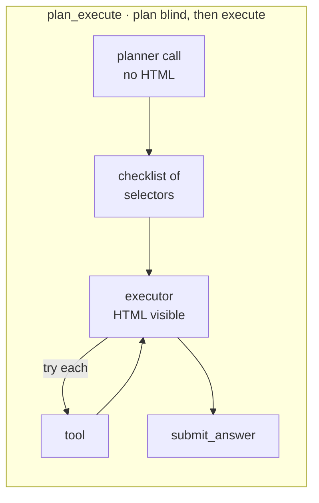

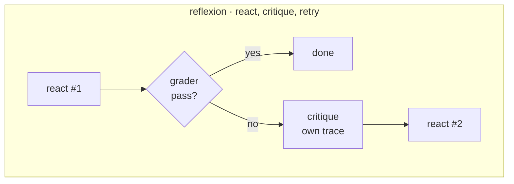

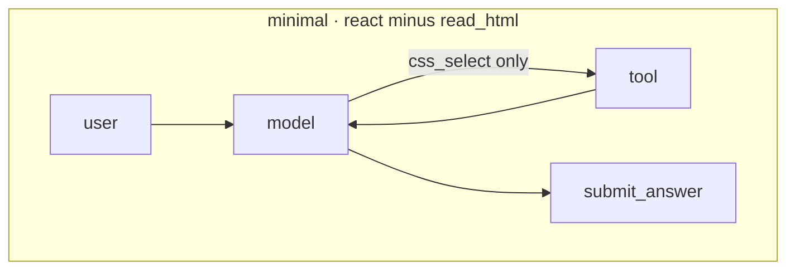

### Code-gen family (5 harnesses — single_shot + react shared with above)

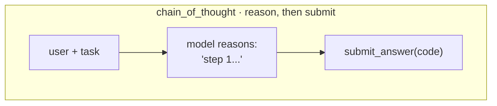

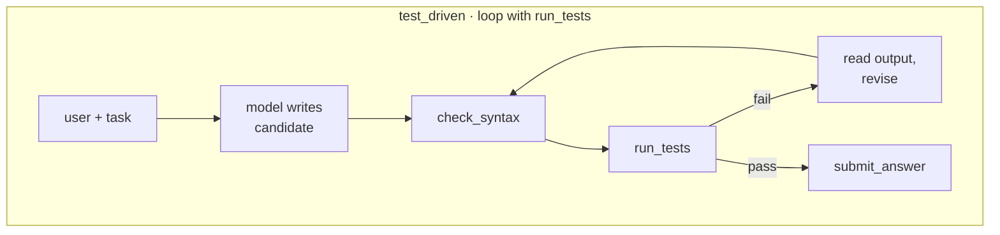

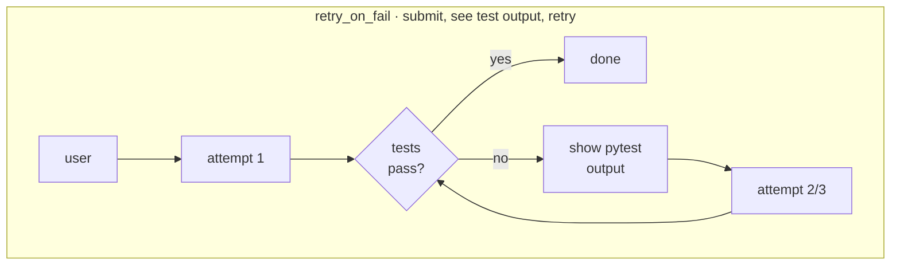

Every harness terminates by calling the same `submit_answer` tool. That's on purpose — parsing free-form text for a JSON answer is a huge confound on weaker models, so the tool channel is a schema-enforcing chokepoint. `single_shot` hit **100% schema compliance** on both task types.

---

## Part 1 — HTML extraction (hard tasks)

**Task**: extract 3–5 fields from 5 messy HTML pages (product, job post, event, recipe, paper metadata). Deterministic grader: per-field normalized exact match.

**Result**: `single_shot` and `plan_execute` tied for best at 9/15 success. `single_shot` did it in **217 s** total; `plan_execute` took **1,957 s** — 9× the wall-clock for the same result. `react` scored 2/15 (worst of five; its Wilson CI doesn't overlap the top tier).

### Headline chart


### Per-task accuracy

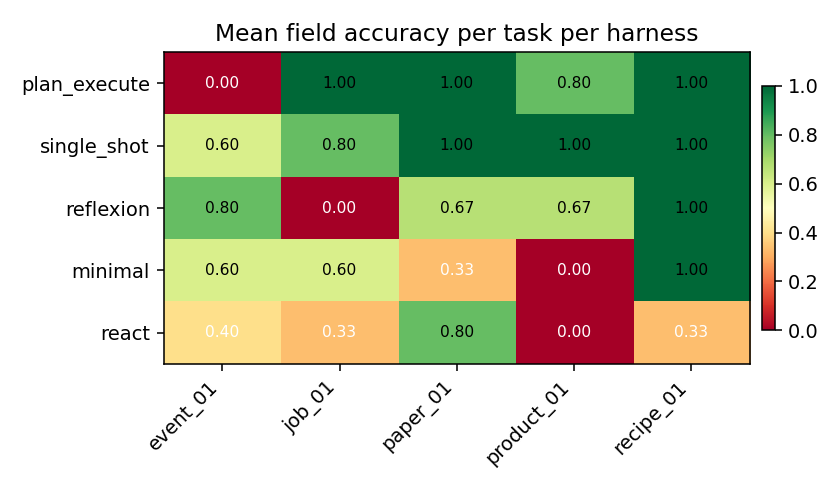

- **`product_01` destroys multi-turn harnesses** — `react` and `minimal` both score 0 because the HTML uses `<div class="brand-line">Brand: <a>Lumina</a></div>`, which no generic selector catches.
- **`paper_01` defeats `reflexion`** — 0/3 seeds. The critique loop locked onto a wrong selector and kept retrying it.

### Where failures came from


Every cell ends one of four ways. `single_shot` is pure green (always cleanly submits). `react` is more than half red — hit an `mismatched arg_key` SDK-boundary error on 8/15 cells. `plan_execute` hits the 12-turn cap on 60% of cells because the planner wrote wrong selectors and the executor had no backchannel to revise them.

<details>
<summary><b>The damning number: 417</b></summary>

Across the whole HTML matrix, `plan_execute` tried the CSS selector `span.date-submitted-date` — **417 times**. That selector does not exist on any page in the benchmark. The planner invented it; the executor fired it into the void 417 times because there's no feedback loop to revise the plan.

**87.6% of `plan_execute`'s CSS-select calls returned `NO_MATCH`.** Nearly nine out of ten selectors were wrong. The turn cap is the only thing that stops the loop.

Top-5 most-retried selectors by harness (full HTML matrix):

```text
plan_execute    417x  span.date-submitted-date      ← retried every paper_01 cell
                 19x  h1
                 12x  .brand
                 12x  .price
                 10x  [itemprop="price"]

minimal           7x  h1
                  6x  [itemprop="name"], [itemprop="brand"], [itemprop="sku"]

reflexion        14x  .arxiv-id-number, .arxiv-id-text, ...
                  9x  .brand

react             4x  h1, h2, h3
                  3x  h1.title, span.primary-category
```

None of `plan_execute`'s top-3 selectors actually match any HTML in the benchmark. The model kept guessing anyway because it couldn't see the HTML when writing the plan.

</details>

<details>
<summary><b>The pilot run would have lied</b></summary>

Before the 75-cell run, a 25-cell pilot (one seed per cell instead of three) produced a completely different ranking:

| harness      | seeds=1 (N=5) | seeds=3 (N=15) | Δ success  |
|--------------|---------------|----------------|------------|
| single_shot  | 0.60          | 0.60           | 0.00       |
| plan_execute | 0.40          | 0.60           | **+0.20**  |
| reflexion    | 0.40          | 0.47           | +0.07      |
| minimal      | 0.60          | **0.27**       | **−0.33**  |
| react        | 0.40          | **0.13**       | **−0.27**  |

`minimal` dropped from tied-for-best to second-worst. `plan_execute` jumped from bottom to tied-for-best. **Three of five rankings flipped.** A single-seed pilot would have published the wrong story.

The summary CSV ships a `seed_success_std` column that flags the flaky ones:

| harness      | seed std | verdict                             |
|--------------|----------|-------------------------------------|
| plan_execute | 0.00     | Deterministic — single seed enough. |
| single_shot  | 0.00     | Deterministic — single seed enough. |
| minimal      | 0.12     | Mild variance.                      |
| reflexion    | 0.23     | **Flaky** — needs more seeds.       |
| react        | 0.23     | **Flaky** — needs more seeds.       |

Multi-turn tool loops branch on model stochasticity at every turn; a one-shot call has exactly one branch point. That's why the flippy ones are flippy.

</details>

### Where the time went


Every orange/red square is a cell where the harness was running in circles. `plan_execute` on `paper_01` alone burned 254 seconds.

---

## Part 2 — Code generation (easy tasks)

**Task**: implement 5 Python functions (fizzbuzz, fibonacci, is_anagram, binary_search, word_count) that pass a pytest suite. **Deterministic grader**: run the task's tests against the submission; success = pytest exit 0.

**Result**: **every harness scored 15/15**. These are textbook algorithm problems that `glm-4.7-flash` solves on the first try. The question shifts from "which works?" to "which is wasteful?"

### Headline chart


| harness          | wall-clock | input tokens | verdict                          |
|------------------|-----------:|-------------:|----------------------------------|
| single_shot      | 283 s      | 6,438        | fastest + cheapest               |
| retry_on_fail    | 328 s      | 6,168        | ready if first try fails (wasn't needed here) |
| react            | 381 s      | 9,189        | 35% slower than single_shot      |
| test_driven      | 478 s      | **35,469**   | 6× the tokens for zero accuracy gain |
| chain_of_thought | **598 s**  | 6,573        | 2× wall-clock of single_shot for CoT prompting |

### Per-task wall-clock

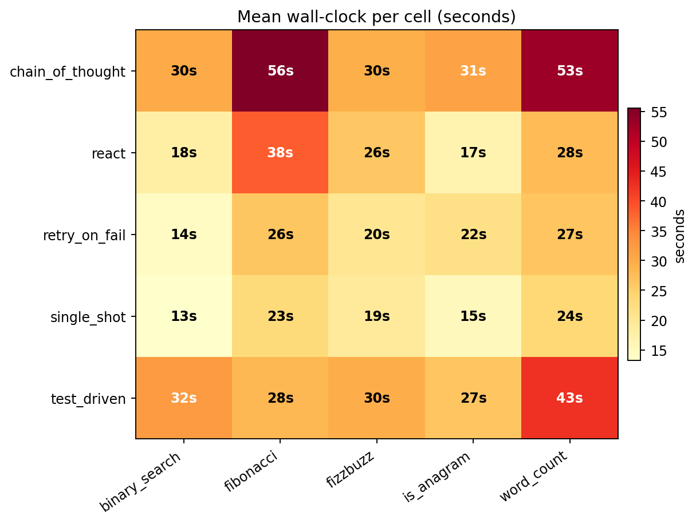

`single_shot` runs every task in 13–24 seconds. `chain_of_thought` sits at 30–56 seconds per task — the step-by-step prompt generates reasoning tokens the model has to produce before getting to the code.

<details>
<summary><b>Where test_driven's extra 29,000 input tokens went</b></summary>

`test_driven` ran the pytest subprocess **30 times** across the 75-cell matrix — that's 2.0 `run_tests` calls per cell on average. Each call feeds the full pytest output back (up to ~1,500 chars) into the model's context as a tool_result.

Per cell: base prompt + signature ≈ 400 tokens; first model reply with code ≈ 300 tokens out; a `run_tests` result ≈ 300 tokens back in; second model reply ≈ 300 tokens out. With ~3 turns per cell that's 1,000 input + 900 output per cell. Times 15 cells ≈ 15k in + 13k out — actual: 35k in + 9k out. The input side blew up more than estimated because every retry feeds the **full** test output back, not just the summary.

The extra tokens are paying for "insurance against the first attempt failing." **On this task set, the first attempt did not fail a single time.** The insurance was never needed.

</details>

### Token efficiency

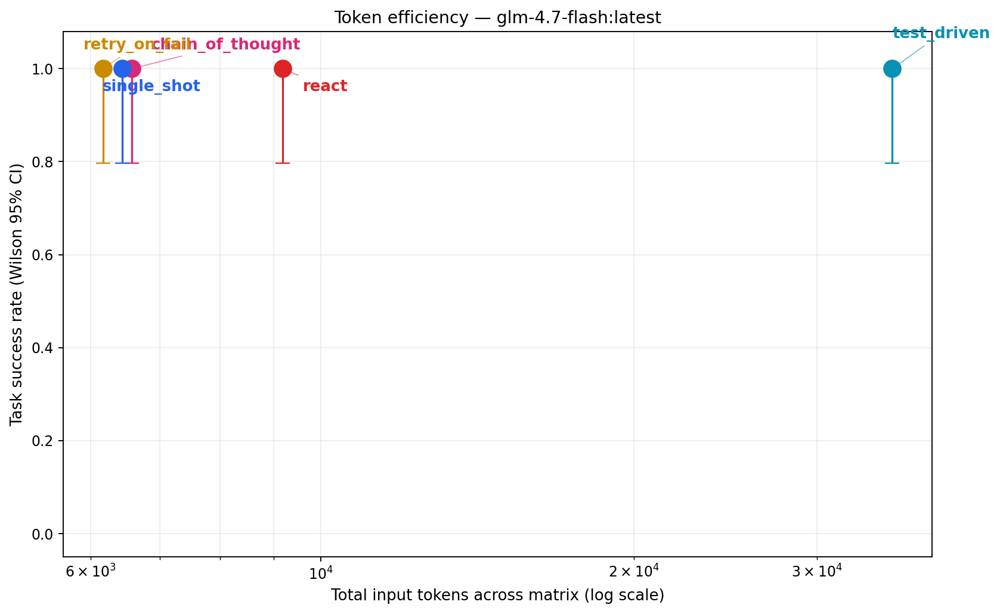

All points sit at y=1.0 (perfect score). The only comparison is horizontal. `test_driven` is alone on the far right at 35k input tokens; everyone else sits around 6–9k. Almost a **6× gap** in tokens for identical accuracy.

---

## The combined lesson

Two experiments, two failure shapes, one conclusion:

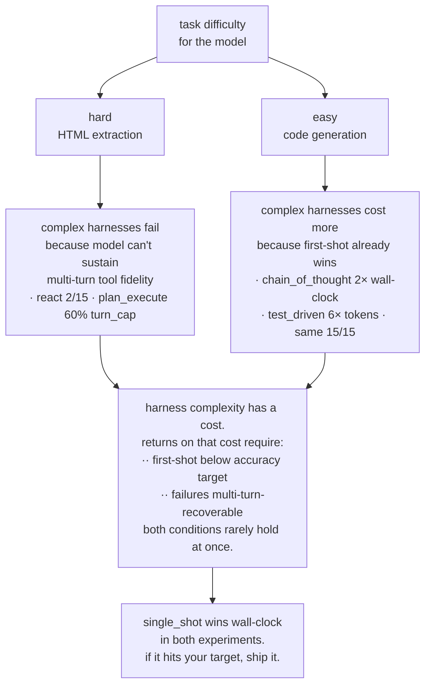

On hard tasks, the failure is "extra turns introduce new failure modes faster than they add accuracy." On easy tasks, the failure is "extra turns waste time and tokens for accuracy the model already had." The two shapes converge on the same engineering advice.

---

## Seven takeaways

1. **Always run `single_shot` as your baseline.** If it hits your accuracy target, ship it. You will not find a faster, cheaper, more reliable harness.
2. **Before investing in multi-turn harnesses, check your model's single-shot schema compliance.** Our `glm-4.7-flash` hit 100% compliance on `single_shot` but its multi-turn tool loops drift. If schema compliance is below ~90%, multi-turn harnesses will underperform on that model.
3. **Never ship a harness comparison at `seeds=1`.** Three of five rankings flipped between N=5 and N=15 in the HTML experiment. Include `seed_success_std` so readers know which rows to trust.
4. **The `submit_answer` universal output channel was load-bearing.** Every harness uses the same submission tool — no free-form text parsing. Eliminates a huge class of weak-model failures.
5. **`plan_execute` needs a feedback loop from executor to plan.** The rigid split produced a 60% turn_cap rate and **one selector retried 417 times** because the executor couldn't revise the plan. Minimum viable fix: a `revise_plan` tool. Correct fix: let the planner see the HTML.
6. **Tool-call error handling belongs in the harness, not the SDK.** `ResponseError: mismatched arg_key` propagated as hard termination on 8/15 `react` cells and 5/15 `reflexion` cells. A naive "retry on malformed tool_call" loop would have recovered most of these.
7. **"Harness complexity dominates within a tier" is a conditional claim.** It's only true where the base model's first-shot success rate is *below target* AND *multi-turn-recoverable*. On `glm-4.7-flash`, the HTML tasks failed condition 2 (model drifts on multi-turn); the code tasks failed condition 1 (model hit 100% first-shot). Complex harnesses paid returns in neither experiment.

---

## Honest scope

- **Two pilots, not two benchmarks.** 5 tasks × 3 seeds per experiment. Wilson CIs overlap for most pairs; only `react`'s worst-of-five ranking on HTML is statistically reliable.
- **One model.** `glm-4.7-flash` is an open-source 19 GB checkpoint on CPU-heavy local inference. Results on Claude Sonnet, GPT-4o, or Gemini 2.0 could reshuffle every ordering.
- **No held-out fixtures.** All HTML pages and code tasks were visible during harness development. See [`HELD_OUT.md`](../HELD_OUT.md) for the explicit decision.
- **Seven tag-moves in the commit log.** Every move documented in [`HARNESSES_FROZEN.md`](../HARNESSES_FROZEN.md) with a reason. No move happened after a matrix had been run against the newer tag — peek-and-patch is structurally prevented by the `check_freeze_gate()` pre-flight.

---

## Reproduce either experiment

```bash
git clone https://github.com/jaafar-benabderrazak/harness-bench && cd harness-bench
pip install -e ".[dev]"
cp .env.example .env         # ollama + glm-4.7-flash default, no API key required
ollama pull glm-4.7-flash:latest
pytest -q                    # 55 tests, all offline

# HTML extraction matrix (~60 min on a modest CPU/GPU)
python scripts/run_full.py --seeds 3 --yes

# Code generation matrix (~25-35 min)
python scripts/run_code_benchmark.py --seeds 3 --yes

# Post-process — produces CSV, all charts, article, trace viewer
python scripts/make_chart.py
```

Everything reproduces locally. Zero API dollars. The run files for the numbers in this article live in `results/runs/` (gitignored per-run; produced fresh on each execution).

---

<details>
<summary><b>Repo + links</b></summary>

- [Full repo](https://github.com/jaafar-benabderrazak/harness-bench) — source, tests, all 8 harness implementations, 2 task types, 55-test offline suite
- [Offline demo](https://github.com/jaafar-benabderrazak/harness-bench/blob/main/scripts/demo_matrix.py) — exercises the pipeline with a deterministic fake model (no API spend, no local model needed)
- [`HELD_OUT.md`](../HELD_OUT.md) — held-out fixture decision + rationale
- [`HARNESSES_FROZEN.md`](../HARNESSES_FROZEN.md) — freeze manifest + tag-move log
- [`README.md`](../README.md) — quickstart, pre-registered hypothesis
- Raw trace data lives in `traces/{harness}/{task}/*.jsonl`; every number here reproducible via `python scripts/make_chart.py` on a committed run file
- Freeze commit: `66fd2ec` (`git rev-parse harnesses-frozen`)
- Earlier standalone articles (kept for history): [article-glm-20260423](article-glm-20260423.html) (HTML only) and [article-code-glm-20260423](article-code-glm-20260423.html) (code only). This page is the combined + enhanced edition.

</details>
