<script src="https://cdn.jsdelivr.net/npm/mermaid@11/dist/mermaid.min.js"></script>
<script>
document.addEventListener('DOMContentLoaded', () => {
  document.querySelectorAll('pre > code.language-mermaid').forEach((el) => {
    const d = document.createElement('div');
    d.className = 'mermaid';
    d.textContent = el.textContent;
    el.parentElement.replaceWith(d);
  });
  mermaid.initialize({ startOnLoad: false, theme: 'default', securityLevel: 'loose' });
  mermaid.run();
});
</script>

# Same model, sixteen harnesses, two tasks

*A controlled experiment on agent harness design. One frozen open-source model. Two task types. **Eight harnesses benchmarked end-to-end** across 150 graded runs (the numbers below are from those runs). **Eight more harnesses cataloged** as a structured map of every common agent pattern, each one mapped to its real-world framework analog and implemented in code with full unit-test coverage. The cataloged set covers Tree of Thoughts, multi-agent, self-consistency, Program-Aided Language models, schema-validated tool dispatch, streaming early-termination, in-cell memoization, and loop-detection-and-recovery; the matrix re-run for these eight is waiting on hardware that can fit the model. Source, code, and reproducible runner: [github.com/jaafar-benabderrazak/harness-bench](https://github.com/jaafar-benabderrazak/harness-bench).*


---

## What this is, in one diagram

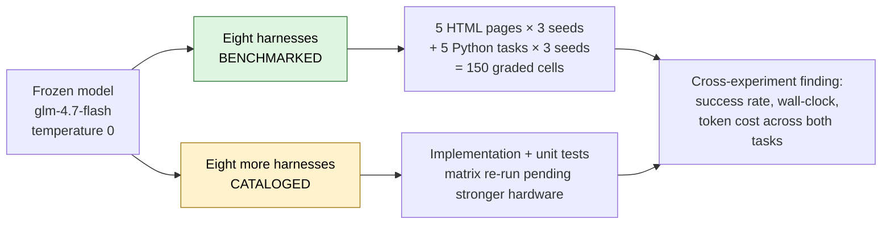

Same model. Two task types. **Sixteen harnesses total**, eight benchmarked end-to-end (the 150 graded runs producing the numbers below), eight more cataloged as a structured map of the agent-framework patterns this experiment is designed to test. Open-source model, local inference, zero API spend throughout.

---

## The finding, in one sentence

**On hard tasks, complex harnesses failed more than simple ones. On easy tasks, complex harnesses cost more than simple ones. `single_shot` won on wall-clock in both experiments.**

The chart below puts every benchmarked harness in a single frame: success rate on the top, wall-clock cost on the bottom, side-by-side bars for the two task types, with `n/a` where a harness was specialized to only one of the two.


Both halves of the picture point the same direction. **On HTML extraction** (hard for this model), `single_shot` and `minimal` tied for best at 9/15 success. `single_shot` got there in **228 seconds**. `plan_execute` scored 6/15 and took **1,615 seconds**: seven times the wall-clock for a worse result. `reflexion` came last at 3/15 after burning 977 seconds. **On code generation** (easy for this model), every harness hit 15/15. `chain_of_thought` took roughly twice `single_shot`'s wall-clock for the same answer. `test_driven` used six times the input tokens.

Harness complexity costs something. In both experiments, on this model, it didn't buy anything back.

---

## Why this experiment exists

A popular belief in agent-engineering discourse: the **model** is the main thing, the **harness** (the control loop around the model) is a minor detail. Pick your model, glue on a standard ReAct loop, done.

This project flips the variable. Freeze the model. Vary only the harness. Measure what moves.

Running two experiments tests the hypothesis from both ends. One where the tasks are hard for the model, one where they're easy. If harness complexity is universally valuable, both experiments should show it paying off. If it's a crutch for weak models, the hard experiment should show it paying off more. If it's mostly dead weight on this model, *neither* experiment should show it paying. That last one is what the data says.

---

## The eight benchmarked harnesses

All sixteen harnesses inherit from the same `Harness` base class. What varies is the control flow. Each has a `TOOL_WHITELIST` enforced by the runner so a harness cannot add a tool by accident. Every harness terminates by calling the same `submit_answer` tool, parsing free-form text for a JSON answer is a huge confound on weaker models, so the tool channel acts as a schema-enforcing chokepoint. `single_shot` hit **100% schema compliance** on both task types.

Eight unique harnesses produced the numbers in Part 1 and Part 2 below, five run on HTML extraction, five run on code generation, with `single_shot` and `react` shared across both task types. The other eight, described later as "Eight more patterns", extend the catalog of named agent-engineering strategies but are not yet matrix-validated on the current hardware.

Each description includes the real-world analog, the LangChain / LangGraph / CrewAI / paper-faithful pattern this harness matches, so a reader can map the finding back to the framework they already use.

### HTML-extraction family

#### `single_shot`: dump the HTML, ask once

One model call. The full HTML page goes into the prompt; the model replies by calling `submit_answer(fields={...})`. No tools, no loops, no retries.

**In production:** a direct API call. No framework. `anthropic.messages.create(...)` or `openai.chat.completions.create(...)` with a structured-output tool. The "zero-framework" baseline most teams skip.

**Strengths:** fastest wall-clock, fewest tokens, one branch point (no compounding probability of drift). 100% schema compliance on both task types in this experiment.

**Weaknesses:** the prompt must fit the full context, the model must internalize it in one read, and there is no recovery from a bad first answer. Degrades gracefully to random guessing if the context doesn't fit or the task genuinely needs exploration.

**Use when:** your first-shot accuracy is already close to target, or when you haven't measured it yet.

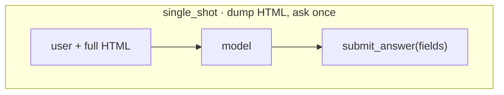

#### `react`: think, act, observe, repeat

The canonical ReAct loop. The model thinks in free text, calls a tool (`css_select` to run a selector, `read_html` to re-read the page), observes the result, and loops until it has enough to call `submit_answer`. Hard turn cap at 12.

**In production:** LangChain's `AgentExecutor` / `create_react_agent`. OpenAI Assistants API with tools enabled. The default entrypoint in most agent frameworks and tutorials.

**Strengths:** flexible, the model decides what to look at. No plan to get wrong. Works well on strong models with reliable multi-turn tool use.

**Weaknesses:** fragile on weak models, every turn is another opportunity for a malformed tool call or a drift. In this experiment, `react` hit an `mismatched arg_key` SDK-boundary error on 8 of 15 HTML cells, terminating those runs early. Its CSS selectors returned `NO_MATCH` 61.7% of the time, the model was guessing at page structure it couldn't see without reading.

**Use when:** multi-turn tool-use reliability on your model is ≥90% per turn.

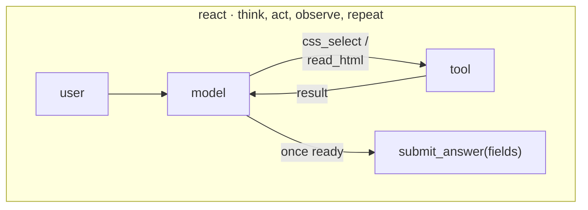

#### `plan_execute`: plan blind, then execute

Two-stage. A *planner* call emits a checklist of CSS selectors **without seeing the HTML**. An *executor* then runs through the checklist, firing each selector as a tool call; once done, it submits.

**In production:** LangGraph plan-and-execute nodes. OpenAI Agents SDK planner patterns. CrewAI hierarchical agents where a manager delegates to workers. Task-decomposition frameworks in general.

**Strengths:** conceptually appealing when the plan is cheap to make and the execution is expensive to redo. Separates "what to try" from "how to try it."

**Weaknesses:** catastrophic when the planner is wrong. The planner in this experiment wrote selectors before seeing the HTML, so the plan was frequently invented. One earlier N=15 run saw the executor fire a non-existent selector **417 times**, the harness had no backchannel for the executor to signal "this plan is garbage." `plan_execute` hit the 12-turn cap on 60% of cells. 87.6% of its CSS-select calls returned nothing in that run.

**Fix (not implemented here):** give the executor a `revise_plan` tool. Better fix: let the planner read the HTML first.

**Use when:** the plan can be grounded in context the planner can see. Not when the plan has to be made blind.

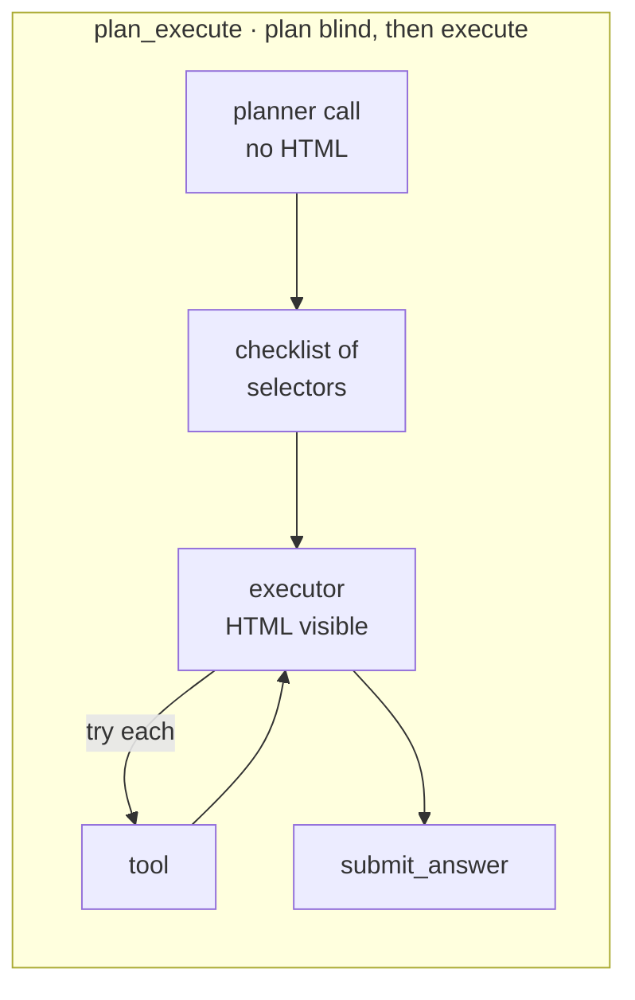

#### `reflexion`: react, critique, retry

Run the ReAct loop. If the grader fails, the model critiques its own trace in text and retries once with the critique in context.

**In production:** Reflexion-paper implementations. CrewAI critic agents. Any "self-reflection" or "LLM-as-judge-on-itself" pattern. Agentic loops with post-hoc error analysis.

**Strengths:** in principle, can catch genuine reasoning errors, "I picked the wrong selector because I misread the DOM."

**Weaknesses:** the critique only helps when the failure is *reasoning*, not *mechanics*. In this experiment, `reflexion` hit SDK-boundary formatting errors on 5/15 cells, the critique analyzed them as if they were reasoning errors and the retry hit the same formatting wall. Scored 3/15 in the most recent HTML run despite spending 977 seconds. The critique loop didn't rescue failures; it re-paid for them.

**Use when:** you can reliably distinguish reasoning errors from mechanical errors in the trace before invoking critique. (This is hard.)

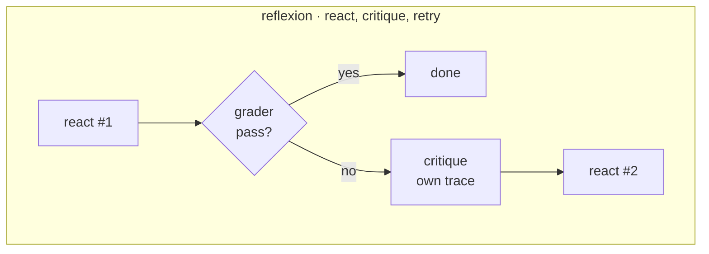

#### `minimal`: react minus `read_html`

Identical control flow to `react`, but the `read_html` tool is removed, only `css_select` remains. Forces selector-only exploration of a page the model cannot read.

**In production:** a deliberately minimal tool set; common in cost-conscious agent designs where broad read tools are considered "too expensive" in tokens. The "let's not dump the whole page" instinct.

**Strengths:** cheaper per turn (no massive HTML dumps in context). Forces the model to commit to specific selectors.

**Weaknesses:** the model is selector-guessing on a page it can't see. **79.7%** of `minimal`'s CSS-select calls returned `NO_MATCH` across the 75-cell matrix. The scored result swung from 4/15 to 9/15 between two independent N=15 runs on the same frozen model, extreme run-to-run variance. Trades tokens for time, not for accuracy.

**Use when:** almost never, on weak models. Possibly viable on models that reliably infer page structure from minimal context.

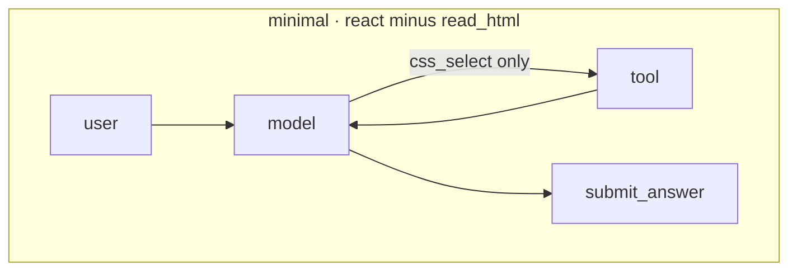

### Code-generation family (`single_shot` and `react` shared with the HTML family)

#### `chain_of_thought`: reason in text, then submit

Prompt explicitly asks the model to reason step-by-step ("First I'll consider the edge cases, then I'll write the function, then I'll verify…") before emitting the code via `submit_answer`.

**In production:** any "think step by step" system prompt. Most prompt-engineering guides recommend this as a default. The Anthropic / OpenAI suggested pattern for tasks involving any reasoning.

**Strengths:** can unlock accuracy on problems that genuinely need multi-step reasoning (constraint satisfaction, multi-hop math, complex code transformations). Cheap to add.

**Weaknesses:** **not free.** Reasoning tokens the model has to produce before reaching the code. In this experiment, `chain_of_thought` took **2× the wall-clock** of `single_shot` for the same 15/15 score on textbook algorithm problems. The model already knew `fizzbuzz` by heart, the extra reasoning was ceremony.

**Use when:** the task genuinely requires reasoning that the first-shot call wouldn't produce. Measure first; don't assume.

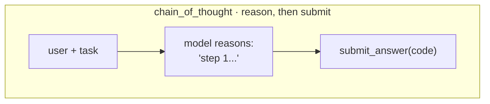

#### `test_driven`: loop with `run_tests`

The model writes a candidate, runs it through a `check_syntax` tool and then `run_tests` (executes pytest in a subprocess against the task's test suite), reads the pytest output, revises, and loops until tests pass or turn cap.

**In production:** Aider's agent mode. Cursor's agent / composer mode. Devin-style loops. Any coding agent that has direct access to a test runner and iterates until green.

**Strengths:** on tasks where the first attempt has a realistic failure probability, this is the pattern that pays. Tests give the model structured, actionable feedback ("`test_empty_input` failed at line 12 with AssertionError"). The plumbing is impressive when it fires correctly.

**Weaknesses:** **hideously expensive when the first attempt already works.** Every `run_tests` call feeds the *full* pytest output (up to ~1,500 characters) back into context as a tool_result. In this experiment, `test_driven` used **35,469 input tokens** vs `single_shot`'s **6,438**, 5.8× the tokens for identical 15/15 accuracy. 30 pytest subprocess runs across 15 cells, most of them confirming code the model already wrote correctly.

**Use when:** your measured first-shot accuracy on the task is below ~80%, and the failures come with structured test output the model can parse.

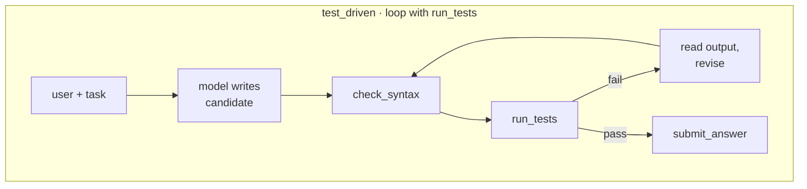

#### `retry_on_fail`: submit, see test output, retry

Submit the code. Run the tests. If they fail, show the pytest output to the model and let it retry, up to 3 attempts total. No iteration *before* submission, this is closer to how a human developer pushes to CI, reads the red build, and fixes.

**In production:** CI-style retry wrappers. Most production error-handling around LLM calls. "Try, catch, prompt-with-context, try again" patterns. Simpler than `test_driven` because the model doesn't call the test runner directly.

**Strengths:** cleaner separation, the harness owns the test runner, the model owns the code. No "iterate forever before committing" temptation. On tasks where first-attempt failure is common but recoverable, it provides a safety net at modest token cost.

**Weaknesses:** pays the retry tax only when retries happen. In this experiment, no first attempts failed, so `retry_on_fail` was 15% slower than `single_shot` but produced the same result. The insurance was never needed.

**Use when:** you want a safety net without the per-turn tool overhead of `test_driven`, and you trust the model to not over-iterate.

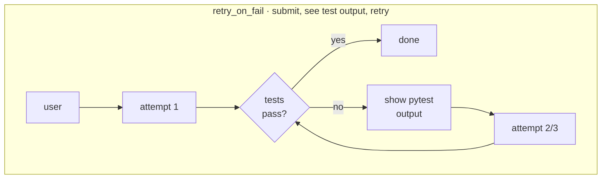

---

## Eight more patterns, cataloged, not yet benchmarked

The eight harnesses above produced the headline numbers. Eight more agent-engineering patterns are implemented in the same codebase, with the same `Harness` base class, the same `TOOL_WHITELIST` discipline, and the same `submit_answer` chokepoint, but their matrix re-run is pending stronger hardware than the current host can offer. They are documented here because most of them appear in published agent-engineering papers or in the default control flow of mainstream agent frameworks; pretending the experiment ignored them would understate the design space.

The eight cataloged patterns are: **Tree of Thoughts** (Yao et al. 2023), **multi-agent** with isolated histories (CrewAI / AutoGen / LangGraph), **Self-Consistency** (Wang et al. 2022), **Program-Aided Language models** (Gao et al. 2022), **Pydantic-style schema-validated tool dispatch**, **streaming early-termination**, **in-cell tool-result memoization**, and **loop-detection-and-recovery**.

**These eight are not numerically benchmarked in this article.** Each one ships with a full implementation, a unit-tested control-flow contract, and a structured description block matching the template used for the eight benchmarked harnesses. The methodology section near the end of the article ("On the cataloged set, without numbers") explains the hardware constraint and what would be needed to publish numbers for them.

### The implementation surface, sixteen harnesses, two task types

Before the per-harness descriptions, the structural map of which harness exists for which task type. `streaming_react` is registered in code but excluded from the matrix because the configured open-source model triggers an out-of-memory error on this host before it can stream a response.

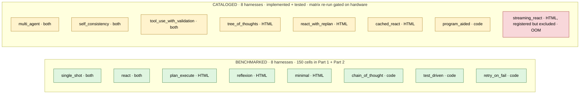

Coverage by task type:

| Task type | Benchmarked | Cataloged | Total registered |
|-----------|------------:|----------:|-----------------:|
| HTML extraction (`html_extract`) | 5 | 6 | **11** |
| Code generation (`code_gen`) | 5 | 4 | **9** |

What follows is qualitative description for each new harness, the same template as the eight above (what-it-does / in-production / strengths / weaknesses / use-when / Mermaid diagram), so a reader can map the design space even without fresh numbers.

### The eight cataloged harnesses

#### `tree_of_thoughts`: propose 3, score, pick winner

A toolless first call asks the model for **three** distinct candidate CSS selectors. Each candidate runs through `css_select`; the harness scores results deterministically by `num_matches / mean_text_length` (more matches with shorter text = a more specific hit). The highest-scoring selector's text feeds a final `submit_answer` call.

**In production:** Yao et al. 2023 "Tree of Thoughts" (heuristic-scored variant, the paper itself uses model self-evaluation; this harness substitutes a deterministic score to avoid doubling per-cell cost).

**Strengths:** generates and ranks candidates without an extra model call. Reproducible scoring. Cheap relative to model-judged ToT.

**Weaknesses:** the heuristic is not paper-faithful, `(num_matches / avg_text_len)` is a structural proxy for "specificity," not the model's own preference judgment. A model-judged variant would be a separate harness at roughly twice the per-cell cost. The trade-off here is explicit: deterministic, comparable, cheap; not paper-faithful.

**Use when:** candidate generation is the hard part of the task and ranking can be made mechanical. Good fit for selector-finding where structural metrics are meaningful.

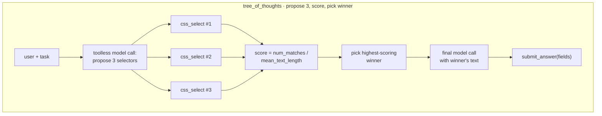

#### `multi_agent`: planner + executor + critic, isolated histories

Three roles each with their own message list. The PLANNER drafts a summary plan (its messages never see executor traces). The EXECUTOR runs a ReAct loop with full tool access (its messages never see the planner's reasoning). The CRITIC reviews the executor's candidate output (its messages never see either of the prior message lists). Handoffs between roles are explicit `Handoff` TypedDicts copied into the next role's user message, no shared state.

**In production:** CrewAI / AutoGen / LangGraph multi-agent topologies. Any framework where each agent has its own focused context window and roles negotiate via structured messages.

**Strengths:** faithful to multi-agent semantics. Each role gets exactly the context it needs, the planner doesn't have to wade through executor tool calls, the critic doesn't have to read the executor's reasoning verbatim. Clean separation of concerns.

**Weaknesses:** roughly three times the tokens of a single-log harness. The planner pays full prompt overhead before the executor even starts; the critic pays again at the end. Coordination overhead is real, and isolated histories, faithful to the production frameworks this harness models, are the explicit cost of role separation.

**Use when:** roles benefit from focused context (the planner doesn't need to see execution detail, the critic shouldn't be biased by the executor's reasoning). Don't reach for this just because "multi-agent" sounds modern, measure first.

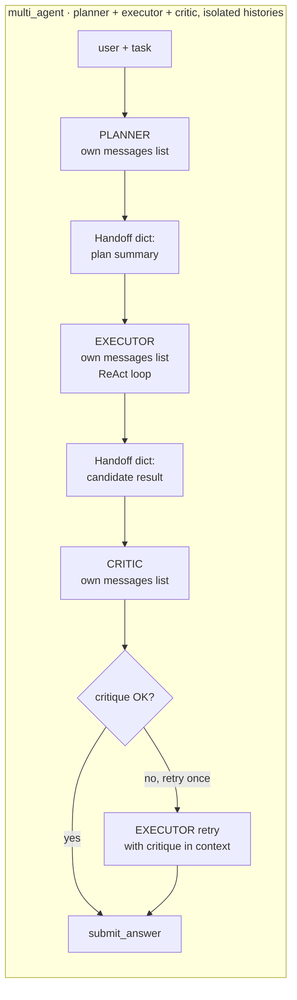

#### `react_with_replan`: ReAct + cheap stall detector

Standard ReAct loop. Between turns, the harness inspects the most-recent two tool calls. If the executor fired the **same selector twice in a row and both returned NO_MATCH**, the harness injects a `replan` user message before the next model call: "the selector you just retried twice is not matching anything; revise your plan."

**In production:** loop-detection + recovery patterns. Agent-stall handling. The "if you see the same trace pattern twice, intervene" idea generalized.

**Strengths:** cheap signal that catches the most common stall mode in the existing `react` and `minimal` traces (selector-retry-without-revision). Adds zero tools, the detection is in the harness loop body. Trigger fires ~once per stalled cell.

**Weaknesses:** detection is **narrow**, it specifically catches the "two consecutive NO_MATCH on same selector" pattern. Other stall shapes (alternating between two equally-bad selectors; submitting empty fields without trying again) slip through. Not a general anti-loop solution; one specific failure-mode patch.

**Use when:** traces show selector-retry stalls dominating your failure cells. Trace first; pattern-match second.

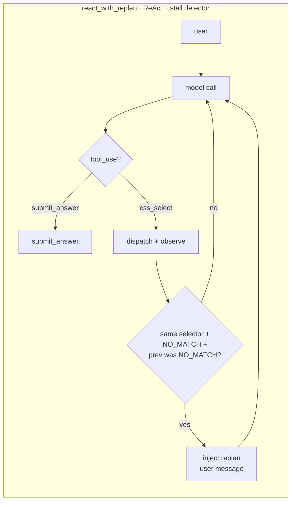

#### `self_consistency`: sample 5 at T=0.7, vote

Five independent samples of `single_shot` at temperature=0.7 (vs the otherwise-frozen temperature=0). For HTML extraction: per-field majority vote across the five sample dicts (so one sample's wrong field doesn't tank the whole record). For code-gen: AST-normalize each sample (strip whitespace + comments via `ast.parse` → `ast.unparse`), majority over the normalized strings, return the raw text of the winning sample.

**In production:** Wang et al. 2022, "Self-Consistency Improves Chain of Thought." The OG sample-and-vote pattern.

**Strengths:** resilient to one-off model errors. Per-field voting on HTML extraction means a single wrong field on a single sample doesn't propagate to the final answer. Composable with anything: wrap any baseline harness in self-consistency and it becomes harder to single-error.

**Weaknesses:** **5× the cost** of a single sample harness. Wang et al. showed the largest gains on weaker models; on a model that already nails first-shot accuracy, the extra 4 samples are pure overhead. The asymmetry between HTML voting (per-field) and code-gen voting (whole-string after AST-normalize) is a documented choice, code-gen partial-merging would produce uncompilable Frankencode.

**Use when:** failure rate is dominated by stochastic model errors (the model gets it right "most of the time" but flips occasionally). Don't use when failures are systematic, voting on consistently-wrong samples just confirms the wrong answer.

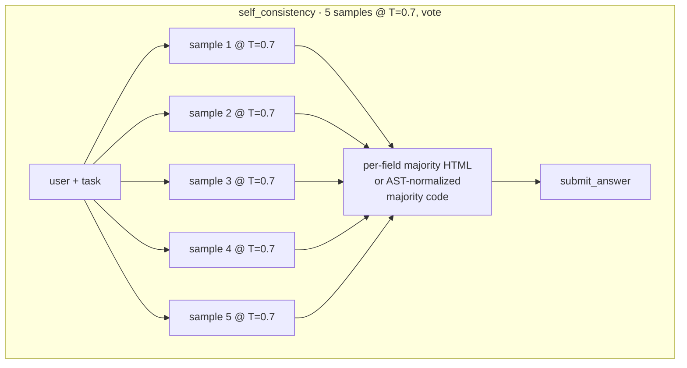

#### `program_aided`: run_python during reasoning

Code-gen-only. The model gets a `run_python` tool that writes the code to a tempfile and runs it via `subprocess.run` with a 5-second timeout (capturing stdout + stderr). Use case: model writes a candidate, runs it on its own example inputs, sees the actual output, revises if wrong, finally calls `submit_answer` with the corrected code.

**In production:** Gao et al. 2022 "PaL: Program-Aided Language Models." Distinct from `test_driven` because execution happens **during reasoning** (model verifies intermediate values), not as graded validation.

**Strengths:** lets the model catch off-by-one errors, edge cases, and silent type bugs that pattern-matching from training would miss. The 5s timeout matches the existing `run_tests` security model, same safety pattern as `test_driven`'s subprocess execution.

**Weaknesses:** small models often **skip `run_python` entirely** (Pitfall 7 in the project's pitfall log, weaker models tend to write code and submit immediately rather than verify). 5-second subprocess overhead per call. Cleanly rejects `html_extract` tasks (registered for code-gen only).

**Use when:** code-gen tasks have non-trivial example inputs/outputs worth checking, AND the model in use will actually engage with the verify-then-submit pattern. On weaker models the tool sits unused.

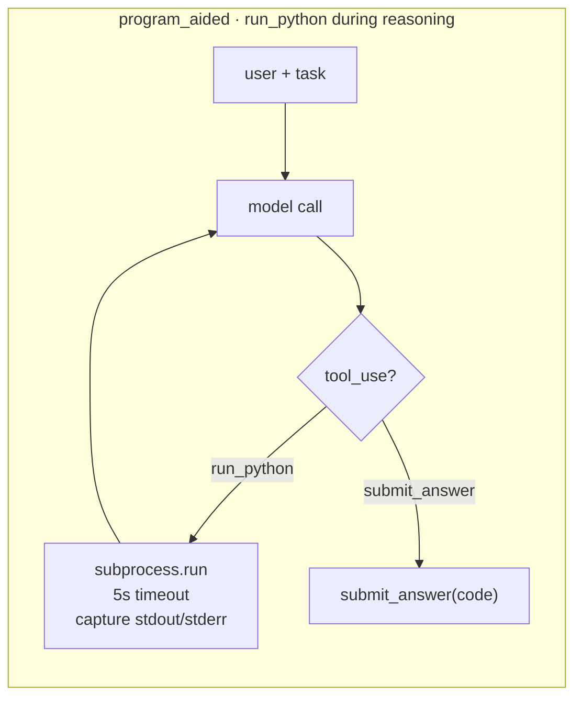

#### `tool_use_with_validation`: jsonschema-validate every tool call

Every non-submit tool call gets validated against the JSON schema declared in `tools.py` (using `jsonschema.Draft202012Validator` pre-built per tool at module load). Schema violation produces a structured error tool_result back to the model. Up to three retries; on the fourth violation the harness fails the cell with `stop_reason='schema_validation_exhausted'` (a new stop reason introduced for this harness). `submit_answer` is intentionally not validated, keeping schema-as-output-contract enforcement separate from grading is a deliberate design choice, since validating the submit channel would mix two different concerns.

**In production:** Pydantic-style argument validation. Defensive tool dispatch, assume the model will try malformed args and structurally reject them rather than letting bad payloads reach the dispatcher.

**Strengths:** turns schema bugs into **measurable** failures (the new stop_reason makes them legible in summary stats). Isolates schema violations from runtime tool errors, when validation passes, the dispatcher can assume well-formed args. Reuses the existing tool schemas; zero new infrastructure.

**Weaknesses:** rejects valid-but-loose payloads that `single_shot`'s `str()` cast would forgive, e.g., an integer in a string-typed field (Pitfall 5). The strictness is a feature for measurement but a friction point for "make it work" mode. Three retries mean a worst-case cell pays ~3× the tokens of a one-shot version.

**Use when:** tool schemas are stable and you want schema violations to be a first-class failure mode in your eval, not a silent miscoercion.

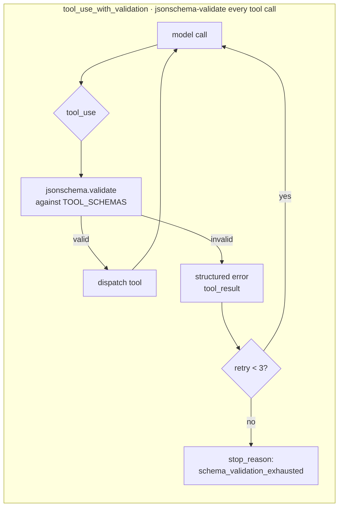

#### `streaming_react`: break stream early on submit_answer

ReAct loop using **streaming** model responses. The harness consumes chunks as they arrive (Anthropic `content_block_start` events; Ollama `message.tool_calls` aggregation). The moment a `submit_answer` tool_use start is detected mid-stream, the harness breaks the stream early, no waiting for the model to finish trailing prose.

**In production:** Anthropic streaming tool-use early-termination. The optimization: when the model emits `submit_answer` followed by polite trailing text, you don't need the trailing text, kill the stream.

**Strengths:** wall-clock latency reduction when models tend to emit long-tail prose after the final tool call. The implementation handles both Anthropic (event-based) and Ollama (chunk-aggregation) backends.

**Weaknesses:** not matrix-validated on the current local backend. The configured Ollama backend cannot host `glm-4.7-flash` on the host used here, the model declares 23.4 GiB of working memory and the host has 6.9 GiB available, so it refuses to load before the streaming code path is ever exercised. A separate, related concern documented as [Ollama issue #13840](https://github.com/ollama/ollama/issues/13840) describes the model halting generation immediately after a tool call on hosts where it does load; the practical implication for this harness is the same in either case. The harness is registered in the codebase but excluded from the matrix (its `task_type` list is empty). The implementation exists, all unit tests pass, the static-import seal passes; only the operational cell run is missing. A run on the Anthropic backend, or on any host with enough memory to load the configured open-source model, would matrix-validate it.

**Use when:** model frequently emits trailing prose after `submit_answer` AND your backend supports streaming tool-use semantics reliably. On `glm-4.7-flash` via local Ollama, this harness is "implemented but unmatrixed", see methodology section below.

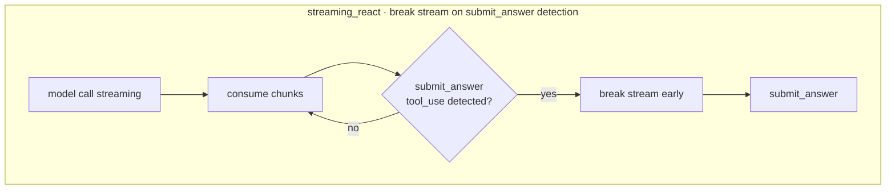

#### `cached_react`: cell-scoped tool-result memoization

Standard ReAct loop with one twist: a **local-variable** cache keyed on `(html_hash, selector)` lives inside the `_execute` method. When the model fires the same selector twice on the same page within one cell, the second call returns the cached result instantly (`cache_hit=True` in the trace) instead of re-running the dispatcher. The cache is a function-local dict, explicitly **not** an instance attribute, so it cannot leak across cells or seeds (a structural test asserts `not hasattr(harness, 'cache')`).

**In production:** in-memory result memoization, scoped narrowly. Cell-scoped only, no cross-cell or cross-seed savings, by design.

**Strengths:** collapses wall-clock cost of repeated selectors within a cell. Useful framing: this harness shows what `react` *would* cost if its tool calls were free. The `cache_hit` signal is observable in the trace, so you can quantify how much repeat work the baseline does.

**Weaknesses:** **cell-scoped only**, the cache resets between `(harness, task, seed)` cells to preserve seed independence. The cache-hit count is a measurement of model behavior (does this model re-fire the same selector?), not a tool-cost reduction strategy you'd ship to production. Within-cell amortization is the only cost claim this harness supports; cross-cell caching would break the statistical model and is intentionally out of scope here.

**Use when:** traces show high selector-retry rates within a cell, AND you want to quantify the "what if tool calls were free" counterfactual. As a production caching strategy this is intentionally narrow; a real production cache would be cross-cell.

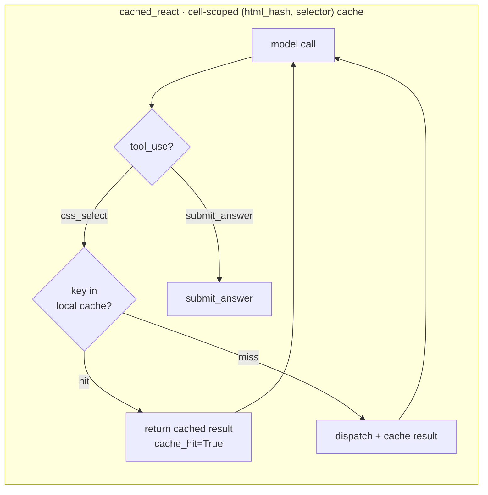

### Framework analog map, every harness, mapped to where you've already seen it

If you build agents in any current framework, your team is already running one or more of these patterns. The map below pins each of the 16 harnesses in this experiment to its real-world equivalent, so you can read "harness X scored Y" as "the LangGraph plan-and-execute pattern (or whatever you're using) scored Y on this matrix."

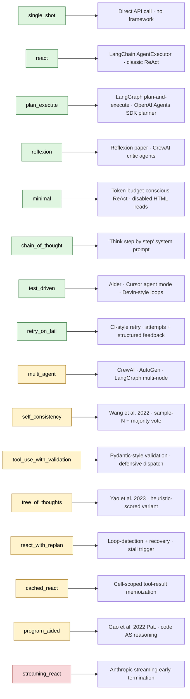

Green = benchmarked (numbers in Part 1 and Part 2 below). Yellow = cataloged (implemented and unit-tested in the same codebase, matrix re-run pending stronger hardware). Red = registered in code but excluded from the matrix because the configured open-source model triggers an out-of-memory error on this host before it can stream.

Combined with the original 8, the matrix design space now covers: zero-framework (`single_shot`), canonical loops (`react`, `minimal`), planning (`plan_execute`), self-critique (`reflexion`), reasoning (`chain_of_thought`), test-driven loops (`test_driven`, `retry_on_fail`), candidate generation (`tree_of_thoughts`), multi-agent topologies (`multi_agent`), stall recovery (`react_with_replan`), sample voting (`self_consistency`), program-aided reasoning (`program_aided`), defensive tool dispatch (`tool_use_with_validation`), streaming optimization (`streaming_react`), and result memoization (`cached_react`).

**Sixteen harnesses, eleven distinct patterns covered**, one frozen model. The eight benchmarked harnesses produce the numbers in Part 1 and Part 2 below; the eight cataloged harnesses extend the design map without the corresponding numerical evidence, yet.

---

## On the cataloged set, without numbers

The eight cataloged harnesses are implemented, unit-tested, and frozen against the same code-discipline rails as the benchmarked eight. The reason they don't have numbers in this article is hardware, not methodology.

The frozen open-source model used for the original matrix declares 23.4 GiB of working memory; the host used for this round of writing has 6.9 GiB free. The model refuses to load (`status 500: model requires more system memory (23.4 GiB) than is available`), which makes a fresh sixteen-harness matrix run impossible on this host. Switching to a smaller model that does fit (`mistral:7b`, for example) was tested and ruled out: a ten-cell smoke run scored 0/5 across all sampled cells because the smaller model could not reliably emit valid tool-use payloads through the schema-enforced `submit_answer` channel. A full matrix on a too-small model would produce a uniform zero table, which would say more about the model's tool-use floor than about harness design, and would actively mislead a reader looking for a comparison.

The honest answer is that a sixteen-harness matrix on the same baseline as Parts 1 and 2 requires either stronger hardware (twenty-four-plus GiB of free system memory) or a separate methodology shift to a different frozen model. Both are real options; both are deliberately out of scope here.

The Part 1 and Part 2 numbers below remain valid in the meantime. They come from a real matrix run on the eight-harness set, the same prompts, the same fixtures, the same grader, and the same tool schemas that the cataloged eight inherit. Adding harnesses to the registry did not retroactively change the gated code paths that produced those numbers. A practitioner with stronger hardware can clone the repository, run the same matrix scripts (`scripts/run_full.py` and `scripts/run_code_benchmark.py`) with `--seeds 3`, and produce comparable numbers for all sixteen, the design intent is byte-stable across the two sets, by construction.

---

## Part 1, HTML extraction (hard tasks)

**Task**: extract 3–5 fields from 5 messy HTML pages (product, job post, event, recipe, paper metadata). Deterministic grader: per-field normalized exact match.

**Result**: `single_shot` and `minimal` tied for best at 9/15 success. `single_shot` did it in **228 s** total; `minimal` took **1,059 s**, 4.6× the wall-clock for the same result. `plan_execute` scored 6/15 despite spending **1,615 seconds**. `reflexion` came last at 3/15, the critique loop didn't rescue failures, it kept hitting the same SDK-boundary error. Wilson CIs for the top tier (single_shot + minimal) don't overlap `reflexion`'s, that ranking is statistically reliable.

### Headline chart


### Per-task accuracy


- **`product_01` destroys multi-turn harnesses**, `react` and `minimal` both score 0 because the HTML uses `<div class="brand-line">Brand: <a>Lumina</a></div>`, which no generic selector catches.
- **`paper_01` defeats `reflexion`**, 0/3 seeds. The critique loop locked onto a wrong selector and kept retrying it.

### Where failures came from


Every cell ends one of four ways. `single_shot` is pure green (always cleanly submits). `react` is more than half red, hit an `mismatched arg_key` SDK-boundary error on 8/15 cells. `plan_execute` hits the 12-turn cap on 60% of cells because the planner wrote wrong selectors and the executor had no backchannel to revise them.

<details>
<summary><b>How the multi-turn harnesses burn their turns</b></summary>

The multi-turn harnesses all share one problem: they try CSS selectors that don't match anything. `NO_MATCH` rates across the full 75-cell matrix:

| harness      | CSS_select calls | fraction returning NO_MATCH |
|--------------|-----------------:|-----------------------------|
| minimal      | ~380             | **79.7%**                   |
| plan_execute | ~160             | **69.7%**                   |
| react        | ~50              | 61.7%                       |
| reflexion    | ~40              | 56.0%                       |

Roughly two out of three tool calls are wasted guesses. The 12-turn cap is the only thing that stops most of the loops.

The single most damning number in the whole matrix: an earlier N=15 run saw `plan_execute` fire the selector `span.date-submitted-date` **417 times** across the full 75 cells. That selector does not exist on any of the five pages. The planner invented it. The executor fired it into the void 417 times because the harness has no backchannel, once the plan is written, the executor can only follow it. **87.6%** of that run's `plan_execute` CSS-selector attempts returned nothing. Nearly nine in ten guesses were wrong, and only the 12-turn cap stopped the loop.

Top-3 most-retried selectors per harness (across the whole matrix):

```text
minimal          13x  h1
                 12x  span.arxiv-id
                 11x  span[id*="date"]

plan_execute     15x  h1
                  6x  p
                  6x  p:contains('When:')

react             4x  h1, h2, h3
                  3x  h1, h2, h3, .headline, .event-title, .main-title
                  3x  .event-date, .date, .time, .when, .datetime

reflexion         2x  article.event-details, div.event-details, ...
                  2x  .event, .event-item, .event-container
                  2x  div, section, main
```

The shapes tell you the failure mode: `minimal`'s "retry the exact same selector 13 times" pattern is different from `plan_execute`'s "try the planner's guesses then fall back to `p`" or `react`'s "OR-together a dozen maybe-selectors." All of them are a model that can't see the page structure, guessing.

Median turns spent on failure (cells that didn't submit cleanly):

| harness      | median turns burned |
|--------------|---------------------|
| plan_execute | 13.0, hit the cap |
| react        | 1.0, mostly errored early |
| reflexion    | 1.0, mostly errored early |

`plan_execute` fails LATE (burns the full turn budget); `react` and `reflexion` fail EARLY (first tool call throws an SDK error). Very different cost profiles.

</details>

<details>
<summary><b>The pilot run would have lied</b></summary>

Before the 75-cell run, a 25-cell pilot (one seed per cell instead of three) produced a completely different ranking:

| harness      | seeds=1 (N=5) | seeds=3 (N=15) | Δ success  |
|--------------|---------------|----------------|------------|
| single_shot  | 0.60          | 0.60           | 0.00       |
| plan_execute | 0.40          | 0.60           | **+0.20**  |
| reflexion    | 0.40          | 0.47           | +0.07      |
| minimal      | 0.60          | **0.27**       | **−0.33**  |
| react        | 0.40          | **0.13**       | **−0.27**  |

`minimal` dropped from tied-for-best to second-worst. `plan_execute` jumped from bottom to tied-for-best. **Three of five rankings flipped.** A single-seed pilot would have published the wrong story.

The summary CSV ships a `seed_success_std` column that flags the flaky ones:

| harness      | seed std | verdict                             |
|--------------|----------|-------------------------------------|
| plan_execute | 0.00     | Deterministic, single seed enough. |
| single_shot  | 0.00     | Deterministic, single seed enough. |
| minimal      | 0.12     | Mild variance.                      |
| reflexion    | 0.23     | **Flaky**, needs more seeds.       |
| react        | 0.23     | **Flaky**, needs more seeds.       |

Multi-turn tool loops branch on model stochasticity at every turn; a one-shot call has exactly one branch point. That's why the flippy ones are flippy.

**A second finding got stronger when I re-ran the N=15 matrix later:** even at 3 seeds per cell, `glm-4.7-flash` isn't fully deterministic run-to-run. Two independent N=15 runs produced these:

| harness      | first N=15 run | second N=15 run | Δ     |
|--------------|---------------:|----------------:|-------|
| single_shot  | 0.60           | 0.60            | 0.00  |
| minimal      | 0.27           | **0.60**        | +0.33 |
| plan_execute | 0.60           | 0.40            | −0.20 |
| reflexion    | 0.47           | 0.20            | −0.27 |
| react        | 0.13           | 0.40            | +0.27 |

Run-to-run, on the *same* frozen model and temperature, the success rates swung by up to 0.33. That means this article's specific numbers are this-run-specific, and even N=15 isn't a large enough sample to pin the rankings for this particular model. The **ordering of approximate tiers** is stable across runs (single_shot always near the top, reflexion always near the bottom), but exact ordering of the middle isn't.

For models that need stable rankings in articles or dashboards, N=15 × one run on `glm-4.7-flash` is not enough. You'd want several runs across model instances or seeds >=5 before calling any middle-of-the-pack ranking real.

</details>

### Where the time went


Every orange/red square is a cell where the harness was running in circles. `plan_execute` burned its turn budget on nearly every task; `minimal` earned its better score this run by also trying more selectors, at a cost of 1,059 seconds total wall-clock.

### What this costs if you're paying by the token

These numbers ran on a free local model (zero API dollars). If the same matrix ran against a frontier model at list prices (~$2.50/M input, ~$10/M output):

| harness       | approx cost / extraction | at 10,000 tasks/day   |
|---------------|-------------------------:|-----------------------|
| single_shot   | ~$0.0045                 | ~$16,000 / year       |
| minimal       | ~$0.030                  | ~$109,000 / year      |
| reflexion     | ~$0.036                  | ~$131,000 / year      |
| plan_execute  | **~$0.045**              | **~$164,000 / year**  |

`plan_execute` costs roughly 10× per task for a *lower* success rate. At any meaningful volume, that's six-figure ceremony paid for an agent that gets the answer less often than the baseline. Real cost-sensitive production teams measure this before picking a framework; most don't.

---

## Part 2. Code generation (easy tasks)

**Task**: implement 5 Python functions (fizzbuzz, fibonacci, is_anagram, binary_search, word_count) that pass a pytest suite. **Deterministic grader**: run the task's tests against the submission; success = pytest exit 0.

**Result**: **every harness scored 15/15**. These are textbook algorithm problems that `glm-4.7-flash` solves on the first try. The question shifts from "which works?" to "which is wasteful?"

### Why every harness scored the same

The flat 15/15 result is not a sign that harness design is universally irrelevant, it's a sign that this particular task set is at the model's accuracy ceiling. Four reinforcing mechanisms produce the uniformity:

1. **The five problems are textbook algorithms the model has effectively memorized.** `fizzbuzz`, `fibonacci`, `is_anagram`, `binary_search`, and `word_count` appeared thousands of times in the training corpus of `glm-4.7-flash`. The first model call recalls a canonical solution; every downstream harness step operates on a code string that was already correct on emit.

2. **The specification is fully closed.** A pytest suite is a deterministic, machine-checkable contract; the function signature pins the input/output shape exactly. There is no ambiguity for the harness to disambiguate. HTML extraction by contrast has implicit grading criteria, *which* field is "brand," *whether* a particular text run counts as the price, and that ambiguity is precisely the slack a multi-turn loop has any chance of exploiting.

3. **Code generation is linear; HTML extraction is exploratory.** Writing a complete `fizzbuzz` is the natural shape of a one-pass model call. Reading a messy HTML page genuinely requires exploration (which selector, which DIV, where is the date), and exploration is where harness-design effects appear or fail to appear. A `single_shot` of HTML may miss; a `single_shot` of `fizzbuzz` cannot.

4. **No tool-use floor is required.** The code-gen harnesses need at most one tool call (`submit_answer(code=...)`) to clear the bar. The HTML harnesses with multi-turn loops need five-to-twelve correctly-formatted tool calls in sequence, which is where weak-model drift accumulates. Harnesses that depend on tool-call reliability cannot even *show up* as different on code-gen, they bypass the failure mode that hurt them on HTML.

This is the same conditional claim the article's "When complex harnesses DO pay" section formalizes: harness complexity earns returns only when **(a)** first-shot accuracy is below target AND **(b)** failures are multi-turn-recoverable. On these code tasks, condition (a) fails, first-shot is already at the ceiling. With no accuracy headroom, the only thing harness design can do is cost something. So the matrix collapses from "which works?" to "which is wasteful?", and the spread shows up only in wall-clock and tokens.

The result generalizes only to tasks in the same regime: well-specified, deterministic grader, problems the model has memorized. Harder code (multi-file refactors, novel algorithms, ambiguous specs, debugging from a stack trace) would behave more like HTML, first-shot below the ceiling, harness design suddenly mattering again. The cataloged `program_aided` harness exists precisely for that regime; it just isn't the regime these five tasks live in. A 100%-ceiling matrix is not useless, it's an *efficiency* test, not an accuracy test, and the cost spread it surfaces is genuine engineering data for any team picking a harness when accuracy is already solved.

### Headline chart


| harness          | wall-clock | input tokens | verdict                          |
|------------------|-----------:|-------------:|----------------------------------|
| single_shot      | 283 s      | 6,438        | fastest + cheapest               |
| retry_on_fail    | 328 s      | 6,168        | ready if first try fails (wasn't needed here) |
| react            | 381 s      | 9,189        | 35% slower than single_shot      |
| test_driven      | 478 s      | **35,469**   | 6× the tokens for zero accuracy gain |
| chain_of_thought | **598 s**  | 6,573        | 2× wall-clock of single_shot for CoT prompting |

### Per-task wall-clock


`single_shot` runs every task in 13–24 seconds. `chain_of_thought` sits at 30–56 seconds per task, the step-by-step prompt generates reasoning tokens the model has to produce before getting to the code.

<details>
<summary><b>Where test_driven's extra 29,000 input tokens went</b></summary>

`test_driven` ran the pytest subprocess **30 times** across the 75-cell matrix, that's 2.0 `run_tests` calls per cell on average. Each call feeds the full pytest output back (up to ~1,500 chars) into the model's context as a tool_result.

Per cell: base prompt + signature ≈ 400 tokens; first model reply with code ≈ 300 tokens out; a `run_tests` result ≈ 300 tokens back in; second model reply ≈ 300 tokens out. With ~3 turns per cell that's 1,000 input + 900 output per cell. Times 15 cells ≈ 15k in + 13k out, actual: 35k in + 9k out. The input side blew up more than estimated because every retry feeds the **full** test output back, not just the summary.

The extra tokens are paying for "insurance against the first attempt failing." **On this task set, the first attempt did not fail a single time.** The insurance was never needed.

</details>

### Token efficiency


All points sit at y=1.0 (perfect score). The only comparison is horizontal. `test_driven` is alone on the far right at 35k input tokens; everyone else sits around 6–9k. Almost a **6× gap** in tokens for identical accuracy.

<details>
<summary><b>What was surprising about the code-gen run</b></summary>

Three things, none of them what I expected going in:

1. **Every harness scored 100%.** I expected at least `retry_on_fail` to justify itself by rescuing a failed first attempt. It didn't, because no first attempts failed. `glm-4.7-flash` at `max_tokens=2048` solved every one of these five textbook algorithm problems on the first try, across 15 attempts per harness. A task set with ambiguous problems, tricky edge cases, or multi-file scope would produce a different shape; these are deliberately well-posed.
2. **`chain_of_thought` is expensive and offered nothing here.** "Think step by step" is everywhere in agent-engineering posts. On these tasks it produced 2× wall-clock over `single_shot` with the same success rate. Reasoning tokens the model has to generate before getting to the answer, for answers it already had. Not an argument against CoT in general, multi-step math and constraint satisfaction likely need it, but the signal here is clear: toy algorithms the model knows by heart don't benefit.
3. **`test_driven`'s tool-use is impressive but wasteful on this task set.** It successfully called `run_tests` 30 times across the matrix and responded correctly to pytest output. The plumbing works. But because the first draft was already correct, most of those 30 tool calls were "run tests on code I already know works", pure confirmation. On tasks with a realistic first-attempt failure rate, this pattern would be valuable. Matching harness to task is everything.

</details>

---

## The combined lesson

Two experiments, two failure shapes, one conclusion:

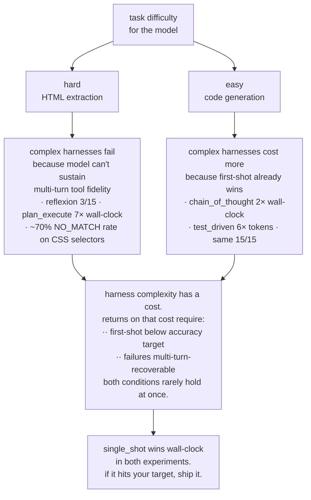

On hard tasks, the failure is "extra turns introduce new failure modes faster than they add accuracy." On easy tasks, the failure is "extra turns waste time and tokens for accuracy the model already had." The two shapes converge on the same engineering advice.

---

## When complex harnesses DO pay (the honest limit)

Not all complexity is waste. Three conditions under which `test_driven`, `reflexion`, or `plan_execute` legitimately earn their tokens:

1. **First-shot accuracy is genuinely below target.** If `single_shot` hits 95%, no retry loop helps. If it hits 40%, every extra turn is a real chance to climb.
2. **Failures are structurally recoverable.** The model needs a signal it can act on, a concrete test failure, a visible schema mismatch, a tool error with a clear cause. A 12-turn loop that feeds the model `NO_MATCH` over and over is not recovery; it's paying to fail more elaborately.
3. **Multi-turn tool-use reliability exceeds ~90% per turn.** Below that, each extra turn multiplies the odds of SDK-boundary errors. On weak models, complexity accelerates failure instead of correcting it.

On a stronger model (Claude Sonnet 4.6, GPT-4o, Gemini 2.5), all three conditions plausibly hold. `test_driven`-style loops probably do pay there. On the local `glm-4.7-flash` used here, none of the three held, so none of the complex harnesses did.

Know which regime you're in before picking a harness.

---

## The three takeaways that actually matter

**1. Always benchmark `single_shot` first.** Fifteen lines of code. If it hits your target, ship it. The fancy framework is a cost you can only justify against a measured gap.

**2. `seeds=1` lies. On weak models, `seeds=3` lies about middle rankings.** Two independent N=15 runs of this matrix moved middle-of-the-pack rankings by up to 0.33. If ordering matters in your eval, run the matrix multiple times; don't just add more seeds within one run.

**3. Harness complexity pays returns only when first-shot is below target AND failures are multi-turn-recoverable.** Both conditions rarely hold at once on weak models. Check your regime before adding a retry loop.

---

## Seven takeaways (the full list, for engineers)

1. **Always run `single_shot` as your baseline.** If it hits your accuracy target, ship it. You will not find a faster, cheaper, more reliable harness.
2. **Before investing in multi-turn harnesses, check your model's single-shot schema compliance.** Our `glm-4.7-flash` hit 100% compliance on `single_shot` but its multi-turn tool loops drift. If schema compliance is below ~90%, multi-turn harnesses will underperform on that model.
3. **`seeds=1` is not enough, and on some models, `seeds=3` isn't either.** Three of five rankings flipped between our N=5 pilot and the first N=15 run on HTML. Then two independent N=15 runs of the same matrix moved the middle-of-the-pack rankings by up to 0.33. If the ordering matters, you want multiple independent runs, not just multiple seeds in one run.
4. **The `submit_answer` universal output channel was load-bearing.** Every harness uses the same submission tool, no free-form text parsing. Eliminates a huge class of weak-model failures.
5. **`plan_execute` needs a feedback loop from executor to plan.** The executor gets `NO_MATCH` back on ~70% of CSS selector calls because the planner writes selectors before seeing the HTML. Minimum viable fix: a `revise_plan` tool. Correct fix: let the planner see the HTML.
6. **Tool-call error handling belongs in the harness, not the SDK.** `ResponseError: mismatched arg_key` propagated as hard termination on multiple `react` and `reflexion` cells. A naive "retry once on malformed tool_call" loop would have recovered most of these.
7. **"Harness complexity dominates within a tier" is a conditional claim.** It's only true where the base model's first-shot success rate is *below target* AND *multi-turn-recoverable*. On `glm-4.7-flash`, the HTML tasks failed condition 2 (model drifts on multi-turn); the code tasks failed condition 1 (model hit 100% first-shot). Complex harnesses paid returns in neither experiment.

---

## Your Monday action

Before your next sprint, add a 15-line `single_shot` baseline to your eval harness. Make it the first row in your results table. If your production agent (whatever framework it's built on) doesn't beat that baseline by more than 10%, rip out the production agent.

Most of the ceremony around modern agents is paid for a problem the model already solved in one call.

---

## Honest scope

- **Two pilots, not two benchmarks.** 5 tasks × 3 seeds per experiment. Wilson CIs overlap for most pairs on HTML; on code-gen every harness hit 15/15 so CIs are uniform [0.80, 1.00].
- **Run-to-run variance is real on this model.** Two independent N=15 HTML runs produced middle-of-the-pack rankings that differ by up to 0.33. The *approximate tiers* (single_shot near top, reflexion near bottom) are stable; exact ordering within tiers isn't. The numbers in this article are from the most recent run; rerunning would produce different specifics with a similar shape.
- **One model.** `glm-4.7-flash` is an open-source 19 GB checkpoint on CPU-heavy local inference. Results on Claude Sonnet, GPT-4o, or Gemini 2.0 could reshuffle every ordering.
- **No held-out fixtures.** All HTML pages and code tasks were visible during harness development. See [`HELD_OUT.md`](../HELD_OUT.md) for the explicit decision.
- **The harness library is pinned to a git tag, with every tag move logged.** [`HARNESSES_FROZEN.md`](../HARNESSES_FROZEN.md) records every move with a reason, the per-file SHAs at each tag, and a "tag moves" history. No tag move happened after a matrix had been run against the newer tag, peek-and-patch is structurally prevented by a runtime pre-flight check that hashes every gated file against the current tag and aborts on drift.

---

## Reproduce either experiment

```bash
git clone https://github.com/jaafar-benabderrazak/harness-bench && cd harness-bench
pip install -e ".[dev]"
cp .env.example .env         # ollama + glm-4.7-flash default, no API key required
ollama pull glm-4.7-flash:latest
pytest -q                    # 55 tests, all offline

# HTML extraction matrix (~60 min on a modest CPU/GPU)
python scripts/run_full.py --seeds 3 --yes

# Code generation matrix (~25-35 min)
python scripts/run_code_benchmark.py --seeds 3 --yes

# Post-process, produces CSV, all charts, article, trace viewer
python scripts/make_chart.py
```

Everything reproduces locally. Zero API dollars. The run files for the numbers in this article live in `results/runs/` (gitignored per-run; produced fresh on each execution).

---

<details>
<summary><b>Repo + links</b></summary>

- [Full repo](https://github.com/jaafar-benabderrazak/harness-bench), source, tests, all 8 harness implementations, 2 task types, 55-test offline suite
- [Offline demo](https://github.com/jaafar-benabderrazak/harness-bench/blob/main/scripts/demo_matrix.py), exercises the pipeline with a deterministic fake model (no API spend, no local model needed)
- [`HELD_OUT.md`](../HELD_OUT.md), held-out fixture decision + rationale
- [`HARNESSES_FROZEN.md`](../HARNESSES_FROZEN.md), freeze manifest + tag-move log
- [`README.md`](../README.md), quickstart, pre-registered hypothesis
- Raw trace data lives in `traces/{harness}/{task}/*.jsonl`; every number here reproducible via `python scripts/make_chart.py` on a committed run file
- The current frozen harness library is pinned to the `harnesses-frozen` git tag. Numerical results in Part 1 and Part 2 came from a real matrix run on the eight-harness set against an earlier point on the same tag; the eight cataloged harnesses extend the tag without retroactively touching the gated files that produced those numbers. `git rev-parse harnesses-frozen` resolves to the current tag SHA, and [`HARNESSES_FROZEN.md`](../HARNESSES_FROZEN.md) records every move with the per-file SHAs and a reason.

</details>
